This document **analyses data** of the [**International Triathlon Union (ITU)**](https://triathlon.org/) to **try** to answer questions such as:

- :penguin: Should bad swimmers be happy when the **wetsuit is allowed**?
- :one_piece_swimsuit: Can the **benefit of swim wetsuits** be estimated?
- :athletic_shoe: Are runs faster since **carbon plates shoes**? 
- :three: Does each sport (swim - bike - run) accounts for 1/3 of race durations? What about transitions?
- :couple: How much faster are **men over women**? In which sport is the gap larger/smaller?
- :hourglass_flowing_sand: How much faster are athletes in **_sprint_ over _olympic_** distance?
- :chart_with_upwards_trend: Does the level increase **over years**?
- :dart: How often does an athlete **win from a bike breakaway**?
- :runner: How often does the **best runner win**?
- :rocket: How often is the win decided with a **sprint finish**?
- :white_flag: What are the most represented **nations**? Which nations have serious problems for their **Olympics selection**?
- :muscle: What is the typical **age** of performing athletes and how has it evolved over years?
- :next_track_button: **How old** are athletes when they **stop racing** ITU races?
- :weight_lifting: What is the **body mass index** of performing triathletes?
- :birthday: Are two kids, born the same year but **on two different months**, equally likely to become professional triathletes?

---

# :books: DATA

Data are collected from the [Triathlon.org API](https://developers.triathlon.org/docs/triathlon-api-overview).

> "The **Triathlon.org API Platform** allows access to the entire [Triathlon.org](https://triathlon.org/) infrastructure and data"

**Race results** are processed as followed:
- **Year**: from `2009` (start of the world-series) to early `2024` (year of writing).
- **Event**: only **`world-cups`**, **`world-series`** (called **WTCS**) and **`games related events`** (Commonwealth, Olympics and Olympic test events).
- **Distance**: only **`sprint`** (`750 - 20 - 5`) and **`olympic`** (also called "standard": `1500 - 40 - 10`) formats.
- **Minimum number of finishers**: `25`.
- IMPORTANT: How to **summarize** all split-times of one race?
  - For each leg (`swim`, `t1`, `bike`, `t2`, `run`), **an average of `5` times** is computed.
  - **The `5`-th to `9`-th best times** of **each sport** are used to compute this average.

Why consider **split-times** based on the **ranking in each sport**?
- Considering the time splits of athletes based **only on their finish ranking** is **problematic** for comparison.
  - A race might feature a strong breakaway group of swimmers reaching T1 with a significant lead, filling the top-10 positions.
  - In the same race, a large pack might arrive at T1 together, with the strongest runners then dominating the overall finish.
  - The split times of the finish-top-10 athletes would vary greatly in these different scenarios, making overall comparisons between races **unreliable**.
- On the other hand, considering the **ranking in each sport** allows for **consistent comparisons** across races, irrespective of overall finish dynamics.

Why consider the **`5`-th to `9`-th best times**?
- To **mitigate outliers**:
  - The **best athletes** might miss a race due to injury, scheduling conflicts, or other reasons. They might also have an exceptionally good or bad day.
  - By focusing on the `5`-th to `9`-th times, the analysis becomes less sensitive to these anomalies, providing a **more stable and consistent representation** of the general competitive field.
- Against **strategic variability** among top performers:
  - The top-4 athletes might employ strategic tactics, such as testing each other and waiting for a final sprint, leading to **varying performances**.
  - Athletes ranked `5`-th to `9`-th are more likely to **give their all without strategic calculations**, resulting in **more robust and consistent comparative times across races**.

What about the data quality?
- The ITU puts efforts to uniform/standardize race reports and race timings. 
- But some **manual cleaning** is required.
  - Some information, such as the permission of **wearing wetsuit**, is often missing.
  - Also, I could not find any way to **access the rankings of past years** via the API.
- Obviously, **variations in distances**, weather conditions, athlete levels and scenarios make **comparisons between race difficult**.
  - Fortunately, the **number of races** is large enough to smooth out these variations and provide interesting insights.
- **Comparing swim-times** can be tricky, not just because the **distances vary** between events, but also because the **positions of timing mats** are not consistent.
  - Most mats are placed directly at the exit of the water, while others are located at the entrance of transition area, which can be hundreds of meters further.

# :card_index_dividers: CONTENT

> My favourite sections are marked with :star:.

- **[Three sports?](#question-THREE-SPORTS)**
- **[Paces](#stopwatch-PACES)** :star:
- **[Women vs men](#couple-WOMEN-VS-MEN)** :star:
- **[Swim gaps](#swimmer-SWIM-GAPS)**
- **[Swim wetsuit benefit](#penguin-WETSUIT-BENEFIT)** :star:
- **[Race scenario](#dart-RACE-SCENARIO)**
- **[Sprint finish](#rocket-SPRINT-FINISH)**
- **[Level over years](#spiral_calendar-LEVEL-OVER-YEARS)** :star:
- **[Host countries](#earth_africa-HOST-COUNTRIES)**
- **[Season duration](#calendar-SEASON-DURATION)** :star:
- **[Athlete nations](#earth_africa-ATHLETE-NATIONS)** :star:
- **[Age](#baby-AGE)**
- **[Age of last race](#checkered_flag-AGE-OF-LAST-RACE)**
- **[Month of birth](#date-MONTH-OF-BIRTH)** :star:
- **[Body mass index](#weight_lifting-BODY-MASS-INDEX)**
- **[Conclusion](#scroll-CONCLUSION)**
  - **[Ideas](#bulb-IDEAS)**
  - **[Takeaways](#takeout_box-TAKEAWAYS)** :star:

---

# :question: THREE SPORTS

This section:
- Investigates the statement: _"swim, bike and run account each for **one third of the total duration**"_.
- Analyses some transition data: t1 and t2.

|                                          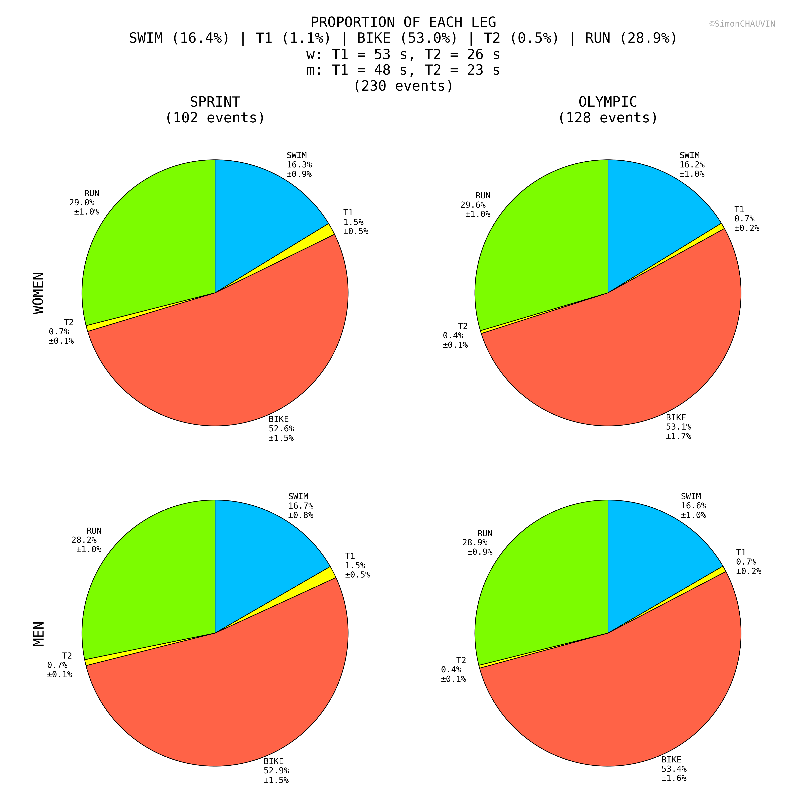                                           | 
|:------------------------------------------------------------------------------------------------------------------------------------:| 
| *Proportion of `swim`, `t1`, `bike`, `t2` and `run` in the overall race duration. For `women`/`men` and `sprint`/`olympic` formats.* |

Clearly **not 1/3 + 1/3 + 1/3**!
- During a sprint format, women spend **twice as much time running (run+t1+t2) as they do swimming**.
- Athletes spend more than **three times longer on their bikes** than in the water.
- The proportion of the three sports remains similar between **sprint and olympic** formats.
  - The proportion of transition time is almost halved: **transitions are fixed durations** while the **race time doubles** from sprint to olympic.
- Women spend **less _relative_ time** on the swim but more on the run.
  - This observation is consistent with the [section on "Women vs Men"](#couple-women-vs-men).

Why **1.5+40+10** as a format?
- The format was [allegedly](https://en.wikipedia.org/wiki/Triathlon) introduced by the producers of the **U.S. Triathlon Series (USTS)** ( :us: ) in the **mid-1980s**
- According to [this article by the Bass Lake triathlon](https://www.basslaketri.com/history):
- _"A need was seen to **standardize the distances** and make them more in **sync with each individual sport**. USTS is credited with inventing the distances of the **modern day Olympic distance triathlon**. For the swim, 1500 meters was chosen because it is the **standard** long distance competitive swimming event. For the bike, USTS chose **40 kilometers because it was the standard solo time trial distance** in bike racing. And the choice for the run was the **standard road distance of 10 km**. Note that the distances were **not chosen to be symmetrical** nor were they in direct ratio to Ironman distances."_

**Drafting** is allowed on bike.
- Otherwise, gaps would probably be much larger, and probably the **bike skills would become much more decisive**.
- I could not find **when the drafting was first allowed** on elite races.
  - In the first ITU world championship in [1989 in Avignon ( :fr: )](https://triathlon.org/results/result/1989_avignon_itu_triathlon_world_championships), drafting [seems to be banned](https://youtu.be/RLmuXOGXQSU?t=1756).
  - **Banning drafting** seems nowadays complicated, considering the **density of the swim level**. Individual starts, e.g. every minute or so like during cycling time-trials, would be an option, and would give the **bike** section a **much higher importance**.  

**T1 and T2 represent a tiny part** of the overall racing time, yet they are **crucial**!
- E.g. to catch a good bunch at bike.

Comparing to **other triathlon formats**:
- Gustav Iden won the IRONMAN world championships in 2022 with the following times.
- "00:48:23" (3.8k), "4:11:06" (180k), "2:36:15" (42k), which represents:
  - **10.6%** swim
  - **55.1%** bike
  - **34.3%** run
- I.e. **More run** and **less swim**, which was expected from the distances: 3.8-180-42 compared to 1.5-40-10.

<details>
  <summary>Click to expand - 🐇🐢 <strong>Some of the shortest and longest transitions.</strong></summary>

_(using Men data)_

#### T1

The duration of **T1** depends the **distance between the water and the transition area**, as well as on the **position of the timing mats**.
- E.g. when the swim exit happens on a sand beach (Mooloolaba ( :australia: ) , Huatulco ( :mexico: ), Hy-Vee ( :us: )), **timing mats are rarely placed directly on the sand**, but instead further, close to the transition area.
- Short T1 are often related to **unusually long swim times**: the best swim time 19:14 at Hy-Vee ( :us: ) 2010, and 22 min at Mooloolaba ( :australia: ) 2012!
  - That is **a shame**: in such cases **swim split times are incorrect**!
  - Mooloolaba ( :australia: ) has apparently **corrected** the position of the timing mats: the fastest T1 in 2015 was **01:15** (against **00:13** in 2012).

|  T1   |                                                                           EVENT                                                                            |
|:-----:|:----------------------------------------------------------------------------------------------------------------------------------------------------------:|
| 00:13 |         [2012 Mooloolaba ITU Triathlon World Cup ( :australia: )](https://www.triathlon.org/events/event/2012_mooloolaba_itu_triathlon_world_cup)          |
| 00:16 |             [2010 Huatulco ITU Triathlon World Cup ( :mexico: )](https://www.triathlon.org/events/event/2010_huatulco_itu_triathlon_world_cup)             |
| 00:16 |                 [2009 Hy-Vee ITU Triathlon Elite Cup ( :us: )](https://www.triathlon.org/events/event/2009_hy-vee_itu_triathlon_elite_cup)                 |
|  ...  |                                                                            ...                                                                             |
| 01:33 |                 [2019 Madrid ITU Triathlon World Cup ( :es: )](https://www.triathlon.org/events/event/2019_madrid_itu_triathlon_world_cup)                 |
| 01:45 | [2017 ITU World Triathlon Grand Final Rotterdam ( :netherlands: )](https://www.triathlon.org/events/event/2017_itu_world_triathlon_grand_final_rotterdam)  |
| 01:50 | [2023 World Triathlon Championship Series Montreal ( :canada: )](https://www.triathlon.org/events/event/2023_world_triathlon_championship_series_montreal) |
| 02:43 |             [2011 Guatape ITU Triathlon World Cup ( :colombia: )](https://www.triathlon.org/events/event/2011_guatape_itu_triathlon_world_cup)             |

#### T2

The duration of T2 is mainly related to the **size of the transition area** (impacted by the number of participants) and to the position of the timing mats.
- Variations are smaller than for T1.

|  T2   |                                                           EVENT                                                           |
|:-----:|:-------------------------------------------------------------------------------------------------------------------------:|
| 00:14 | [2011 Mooloolaba ITU Triathlon World Cup](https://www.triathlon.org/events/event/2011_mooloolaba_itu_triathlon_world_cup) |
| 00:14 | [2012 Mooloolaba ITU Triathlon World Cup](https://www.triathlon.org/events/event/2012_mooloolaba_itu_triathlon_world_cup) |
| 00:15 |  [2010 Monterrey ITU Triathlon World Cup](https://www.triathlon.org/events/event/2010_monterrey_itu_triathlon_world_cup)  |
|  ...  |                                                            ...                                                            |
| 00:36 |   [2016 Montreal ITU Triathlon World Cup](https://www.triathlon.org/events/event/2016_montreal_itu_triathlon_world_cup)   |
| 00:36 |   [2019 Banyoles ITU Triathlon World Cup](https://www.triathlon.org/events/event/2019_banyoles_itu_triathlon_world_cup)   |
| 00:41 |    [2017 Salinas ITU Triathlon World Cup](https://www.triathlon.org/events/event/2017_salinas_itu_triathlon_world_cup)    |

#### T1+T2

On average, T1+T2 takes **01:11** (men) and **01:18** (women).
- As mentioned for T1, **very short times** are mainly due to **wrong positions of the timing mats after the swim**: they are placed at the entrance of the transition area **instead of at the water exit**.
- Longer T1+T2 means athletes must **run more distance** to reach their bikes / shoes.
  - In Montreal ( :canada: ) 2023, it was 02:14: **more than one minute than usual**.
  - For a sprint format, this is **substantial**: compared to the 15:05 average men's 5k, this long transition makes the **run 7% longer**!

| T1+T2 |                                                                     EVENT                                                                     | DISTANCe |
|:-----:|:---------------------------------------------------------------------------------------------------------------------------------------------:|:--------:|
| 00:27 |           [2012 Mooloolaba ITU Triathlon World Cup](https://www.triathlon.org/events/event/2012_mooloolaba_itu_triathlon_world_cup)           | OLYMPIC  |
| 00:34 |               [2009 Hy-Vee ITU Triathlon Elite Cup](https://www.triathlon.org/events/event/2009_hy-vee_itu_triathlon_elite_cup)               | OLYMPIC  |
| 00:37 |             [2010 Huatulco ITU Triathlon World Cup](https://www.triathlon.org/events/event/2010_huatulco_itu_triathlon_world_cup)             | OLYMPIC  |
| 00:44 |             [2022 World Triathlon Cup Vina del Mar](https://www.triathlon.org/events/event/2022_world_triathlon_cup_vina_del_mar)             |  SPRINT  |
|  ...  |                                                                      ...                                                                      |   ...    |
| 01:48 |                [2014 ITU World Triathlon Stockholm](https://www.triathlon.org/events/event/2014_itu_world_triathlon_stockholm)                |  SPRINT  |
| 01:57 |    [2017 ITU World Triathlon Grand Final Rotterdam](https://www.triathlon.org/events/event/2017_itu_world_triathlon_grand_final_rotterdam)    | OLYMPIC  |
| 02:14 | [2023 World Triathlon Championship Series Montreal](https://www.triathlon.org/events/event/2023_world_triathlon_championship_series_montreal) |  SPRINT  |
| 02:58 |              [2011 Guatape ITU Triathlon World Cup](https://www.triathlon.org/events/event/2011_guatape_itu_triathlon_world_cup)              |  SPRINT  |

</details>

---

---

# :stopwatch: PACES

It is worth recalling the [data](#books-data) settings:

- Year: from `2009` to early `2024`.
- Event: only **`world-cups`**, **`world-series`** (called **WTCS**) and **`games related events`**.
- Distance: only **`sprint`** and **`olympic`** formats.
- At least `25` finishers.
- :warning: **IMPORTANT:** for each leg of a race (`swim`, `bike`, `run`), **an average of `5` times** is computed, using the **`5`-th to `9`-th best times of the leg**.

| 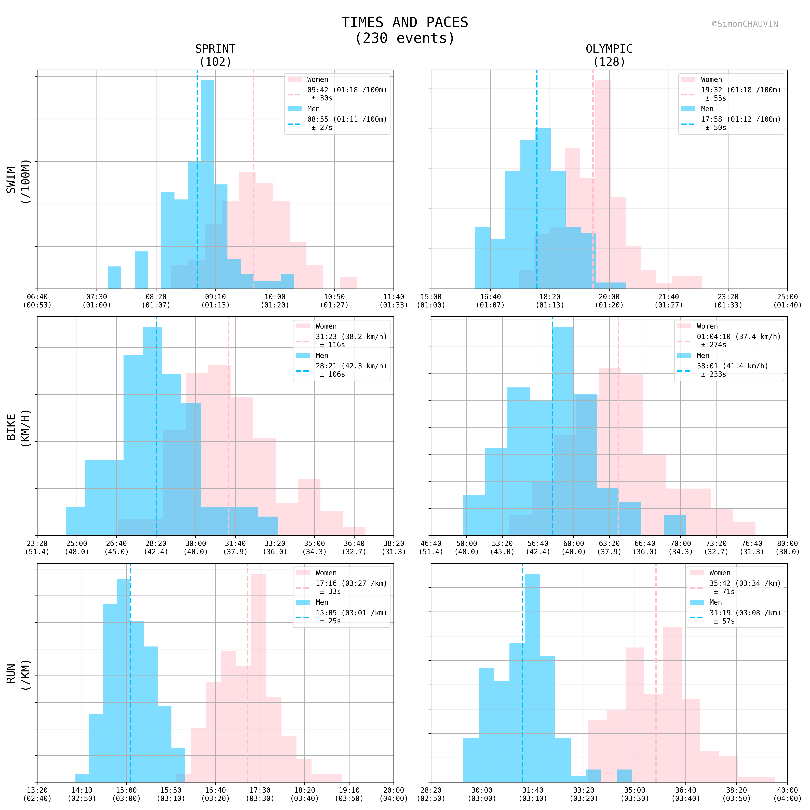 | 
|:-----------------------------------------:| 
|    *Distributions of times and paces.*    |

Note: The distribution of swim times includes races **with and without wetsuit**. A [subsequent section](#penguin-wetsuit-benefit) does the distinction (see its _"second method"_ subsection), which reduces the standard deviation by 5-10s.

<details>
  <summary>Click to expand - ⏱️ <strong>Pace/speed/5k/10k conversion for the run.</strong></summary>

| Run Pace (M:SS) | Speed (km/h) | 5k Time (MM:SS) | 10k Time (MM:SS) |
|:---------------:|:------------:|:---------------:|:----------------:|
|      2:55       |     20.6     |      14:35      |      29:10       |
|      2:56       |     20.5     |      14:40      |      29:20       |
|      2:57       |     20.3     |      14:45      |      29:30       |
|      2:58       |     20.2     |      14:50      |      29:40       |
|      2:59       |     20.1     |      14:55      |      29:50       |
|      3:00       |     20.0     |      15:00      |      30:00       |
|      3:01       |     19.9     |      15:05      |      30:10       |
|      3:02       |     19.8     |      15:10      |      30:20       |
|      3:03       |     19.7     |      15:15      |      30:30       |
|      3:04       |     19.6     |      15:20      |      30:40       |
|      3:05       |     19.5     |      15:25      |      30:50       |
|      3:06       |     19.4     |      15:30      |      31:00       |
|      3:07       |     19.3     |      15:35      |      31:10       |
|      3:08       |     19.1     |      15:40      |      31:20       |
|      3:09       |     19.0     |      15:45      |      31:30       |
|      3:10       |     18.9     |      15:50      |      31:40       |
|      3:11       |     18.8     |      15:55      |      31:50       |
|      3:12       |     18.8     |      16:00      |      32:00       |
|      3:13       |     18.7     |      16:05      |      32:10       |
|      3:14       |     18.6     |      16:10      |      32:20       |
|      3:15       |     18.5     |      16:15      |      32:30       |
|      3:16       |     18.4     |      16:20      |      32:40       |
|      3:17       |     18.3     |      16:25      |      32:50       |
|      3:18       |     18.2     |      16:30      |      33:00       |
|      3:19       |     18.1     |      16:35      |      33:10       |
|      3:20       |     18.0     |      16:40      |      33:20       |
|      3:21       |     17.9     |      16:45      |      33:30       |
|      3:22       |     17.8     |      16:50      |      33:40       |
|      3:23       |     17.7     |      16:55      |      33:50       |
|      3:24       |     17.6     |      17:00      |      34:00       |
|      3:25       |     17.6     |      17:05      |      34:10       |
|      3:26       |     17.5     |      17:10      |      34:20       |
|      3:27       |     17.4     |      17:15      |      34:30       |
|      3:28       |     17.3     |      17:20      |      34:40       |
|      3:29       |     17.2     |      17:25      |      34:50       |
|      3:30       |     17.1     |      17:30      |      35:00       |
|      3:31       |     17.1     |      17:35      |      35:10       |
|      3:32       |     17.0     |      17:40      |      35:20       |
|      3:33       |     16.9     |      17:45      |      35:30       |
|      3:34       |     16.8     |      17:50      |      35:40       |
|      3:35       |     16.7     |      17:55      |      35:50       |
|      3:36       |     16.7     |      18:00      |      36:00       |
|      3:37       |     16.6     |      18:05      |      36:10       |
|      3:38       |     16.5     |      18:10      |      36:20       |
|      3:39       |     16.4     |      18:15      |      36:30       |
|      3:40       |     16.4     |      18:20      |      36:40       |

</details>

Outliers:
- The swim of [2012 Mooloolaba ITU Triathlon World Cup ( :australia: )](https://www.triathlon.org/events/event/2012_mooloolaba_itu_triathlon_world_cup) has been dropped - see the previous section about [T1](#T1).
- The swim of [2024 Paris ( :fr: ) Olympics](https://triathlon.org/results/result/paris_2024_olympic_games/655047) is kept, despite the **current** on the way back which made it very though:
  - 20:29 (**01:22** /100m) for men.
  - 22:36 (**01:30** /100m) for women.

**Sprint vs olympic** format:
- :swimmer: Swim **paces are identical** for 750m and 1500m.
- :bicyclist: There is **less than 1km/h difference** between the 20k and 40k bike.
- :runner: The 10k run requires **7s/km more** than the 5k.

The next section analyses the time differences between **women and men**.

---

---

# :couple: WOMEN VS MEN

The difference in percent is computed with:

```
diff_in_percent = (time_w - time_m) / time_m

I.e.
time_w = (1 + diff_in_percent) * time_m
```

This percentage says **_"by how much are women slower than men"_**.
- To know _"by how much are men faster"_, use `diff_in_percent / (1 + diff_in_percent)`.  

|      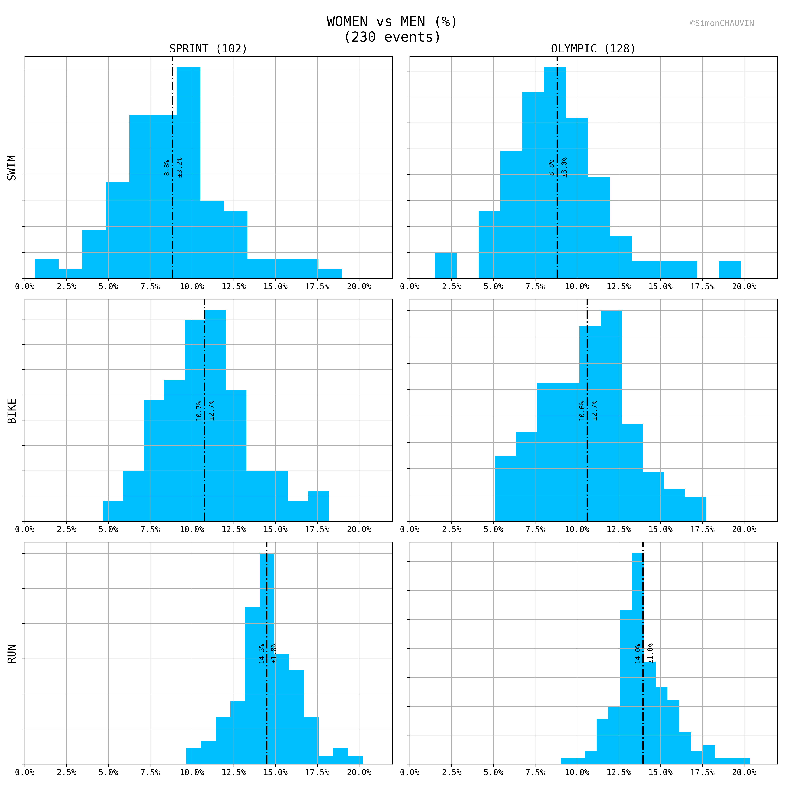      | 
|:-------------------------------:| 
| *By how much are women slower?* |

Notes about **swim data**:
- For fairness, the only **data with identical equipment** (wetsuit or not) for women and men is considered. 
- Some outliers have been removed - can it be due to the **swim being in an ocean/sea? :ocean:**:
  - **25%** at [2022 World Triathlon Cup Miyazaki ( :jp: )](https://www.triathlon.org/events/event/2022_world_triathlon_cup_miyazaki) (sprint): 5th women and men in resp. [`11:03`](https://triathlon.org/results/result/2022_world_triathlon_cup_miyazaki/550760) and [`08:47`](https://www.triathlon.org/results/result/2022_world_triathlon_cup_miyazaki/550759).
  - **27%** at [2023 World Triathlon Cup Valencia ( :es: )](https://www.triathlon.org/events/event/2023_world_triathlon_cup_valencia) (olympic): 5th women and men in resp. [`22:18`](https://triathlon.org/results/result/2023_world_triathlon_cup_valencia/582219) and [`17:30`](https://www.triathlon.org/results/result/2023_world_triathlon_cup_valencia/582218).
  - **28%** at [2009 Dextro Energy Triathlon - ITU World Championship Grand Final Gold Coast ( :australia: )](https://www.triathlon.org/events/event/2009_dextro_energy_triathlon_-_itu_world_championship_grand_final_gold_coas) (olympic): Liz Blatchford and Javier Gomez are 5th out of water in resp. [`21:47`](https://www.triathlon.org/results/result/2009_dextro_energy_triathlon_-_itu_world_championship_grand_final_gold_coas/4818) and [`17:02`](https://triathlon.org/results/result/2009_dextro_energy_triathlon_-_itu_world_championship_grand_final_gold_coas/4819).  

Findings:
- :swimmer: The **swim** is the sport where the **relative difference** between women and men is the **smallest**.
  - Swimming is highly **technique-oriented**.
  - Women often excel in technical sports because these **rely less on raw strength** and more on skill, coordination, and efficiency.
  - (Do men have less fat, leading to poorer buoyancy? I have not taken the time to verify this statement.)
- :runner: The **run** is where the difference is the **largest**.
  - Men typically have **greater muscle mass** and **aerobic capacity**, which can provide an advantage in endurance activities like running.
- The **standard deviation** is **higher for swim and lower for run**.
  - Because **swim conditions can vary** and athletes may follow non-straight swim lines leading to larger swim distances.

Would these differences remains similar if the run were done first and the swim last?
- **Fatigue resistance** might vary more significantly between men and women.

These **percentages can be compared** with those of **swim, bike or run competitions**:

<details>
  <summary>Click to expand - 🏊🚴🏃 <strong>Comparisons to individual swim/bike/run.</strong></summary>

**`diff_percent = (time_w - time_m) / time_m`** is computed for a **couple of events** taken individually.
- It would be **statistically more significant** to **consider many events** and compute **averages**.
- I have not taken the time to do that.

:swimmer: **SWIM**
- :jp: **2021 Tokyo 800m: `diff_percent = 7.7%`** considering the 4th to 8th [men](https://olympics.com/en/olympic-games/tokyo-2020/results/swimming/men-s-800m-freestyle) and [women](https://olympics.com/en/olympic-games/tokyo-2020/results/swimming/women-s-800m-freestyle):
  - `times_m = [7:42.68, 7:45.00, 7:45.11, 7:49.14, 7:53.31]`
  - `times_w = [8:19.38, 8:21.93, 8:22.25, 8:24.56, 8:26.30]`
  - In previous olympic games, there was **no men's 800m**.
    - In Rio, the 4th-8th women average was less than 1s different to Tokyo.
- :jp: **2021 Tokyo 10k: `diff_percent = 8.2%`** considering the 5th to 9th [men](https://en.wikipedia.org/wiki/Swimming_at_the_2020_Summer_Olympics_%E2%80%93_Men%27s_marathon_10_kilometre) and [women](https://en.wikipedia.org/wiki/Swimming_at_the_2020_Summer_Olympics_%E2%80%93_Women%27s_marathon_10_kilometre):
  - `times_m = [1:49:29, 1:50:23, 1:51:30, 1:51:32, 1:51:37]`
  - `times_w = [1:59:35, 1:59:36, 1:59:37, 2:00:10, 2:00:57]`
  - **Open-water conditions** are closer to the one of triathlon, but the 10k race involves more strategy.

:bicyclist: **BIKE**
- Which race format?
  - **Non-TT cycling race** often **involve strategy**, making time comparison between women and men irrelevant.
  - ICU time-trial (TT) world championships uses **different distances** for [women](https://en.wikipedia.org/wiki/UCI_Road_World_Championships_%E2%80%93_Women%27s_time_trial) and [men](https://en.wikipedia.org/wiki/UCI_Road_World_Championships_%E2%80%93_Men%27s_time_trial), making the comparison difficult.
  - Fortunately **regional and national TT championships** use the same distance and can therefore give **relevant examples of `diff_percent`**.
- :us: **2024 USA TT: `diff_percent = 11.1 %`** between Taylor Knibb ([`41:54`](https://my.raceresult.com/290103/#2_45D764)) and Brandon McNulty ([`37:42`](https://my.raceresult.com/290103/#4_B2D212))
- :eu: **2023 European TT: `diff_percent = 12.3%`** considering the 5th to 9th [men](https://en.wikipedia.org/wiki/2023_European_Road_Championships_%E2%80%93_Men%27s_time_trial) and [women](https://en.wikipedia.org/wiki/2023_European_Road_Championships_%E2%80%93_Women%27s_time_trial):
  - `times_m = [32:43.77, 32:45.91, 32:52.03, 32:55.19, 32:55.22]`
  - `times_w = [36:42.01, 36:49.02, 36:53.75, 37:02.27, 37:05.13]`
- :eu: **2022 European TT: `diff_percent = 14.8%`** considering the 5th to 9th [men](https://en.wikipedia.org/wiki/2022_European_Road_Championships_%E2%80%93_Men%27s_time_trial) and [women](https://en.wikipedia.org/wiki/2022_European_Road_Championships_%E2%80%93_Women%27s_time_trial):
  - `times_m = [27:42.81, 28:01.56, 28:17.61, 28:18.47", 28:27.19]`
  - `times_w = [32:00.87, 32:01.10, 32:30.76, 32:32.76", 32:37.85]`

:running: **RUN**
- `diff_percent` is computed in the same way.
  - But keep in mind that running competitions are **often very strategic**: the time matters often less than the ranking.
    - For instance, on the athletic track the **pace can be kept low until the last lap**.
  - **Comparing world/continental/national records** for women vs men is an option, but the level of one outstanding person says nothing about the **average level**.
- :eu: **2024 European 10k: `diff_percent = 13.8%`** considering the 5th to 9th [men](https://en.wikipedia.org/wiki/2024_European_Athletics_Championships_%E2%80%93_Men%27s_10,000_metres) and [women](https://en.wikipedia.org/wiki/2024_European_Athletics_Championships_%E2%80%93_Women%27s_10,000_metres):
  - `times_m = [31:34.90, 31:38.45, 32:15.91, 32:16.85, 32:17.24]`
  - `times_w = [28:01.42, 28:04.43, 28:09.87, 28:10.97, 28:11.61]`
- :eu: **2024 European 5k: `diff_percent = 11.6%`** considering the 5th to 9th [men](https://en.wikipedia.org/wiki/2024_European_Athletics_Championships_%E2%80%93_Men%27s_5000_metres) and [women](https://en.wikipedia.org/wiki/2024_European_Athletics_Championships_%E2%80%93_Women%27s_5000_metres):
  - `times_m = [14:44.72, 14:58.28, 15:00.05, 15:02.56, 15:05.66]`
  - `times_w = [13:23.26, 13:24.54, 13:24.80, 13:25.08, 13:25.65]`
- :fr: **2024 Paris marathon: `diff_percent = 13.7%`** considering the 5th to 9th [men](https://worldathletics.org/competition/calendar-results/results/7208360) and [women](https://worldathletics.org/competition/calendar-results/results/7208360?eventId=10229534&gender=W):
  - `times_m = [2:24:48, 2:26:00, 2:26:01, 2:26:03, 2:26:08]`
  - `times_w = [2:07:37, 2:07:39, 2:07:44, 2:08:41, 2:09:04]`

</details>

---

#### Focus on the swim: :swimmer:

|                             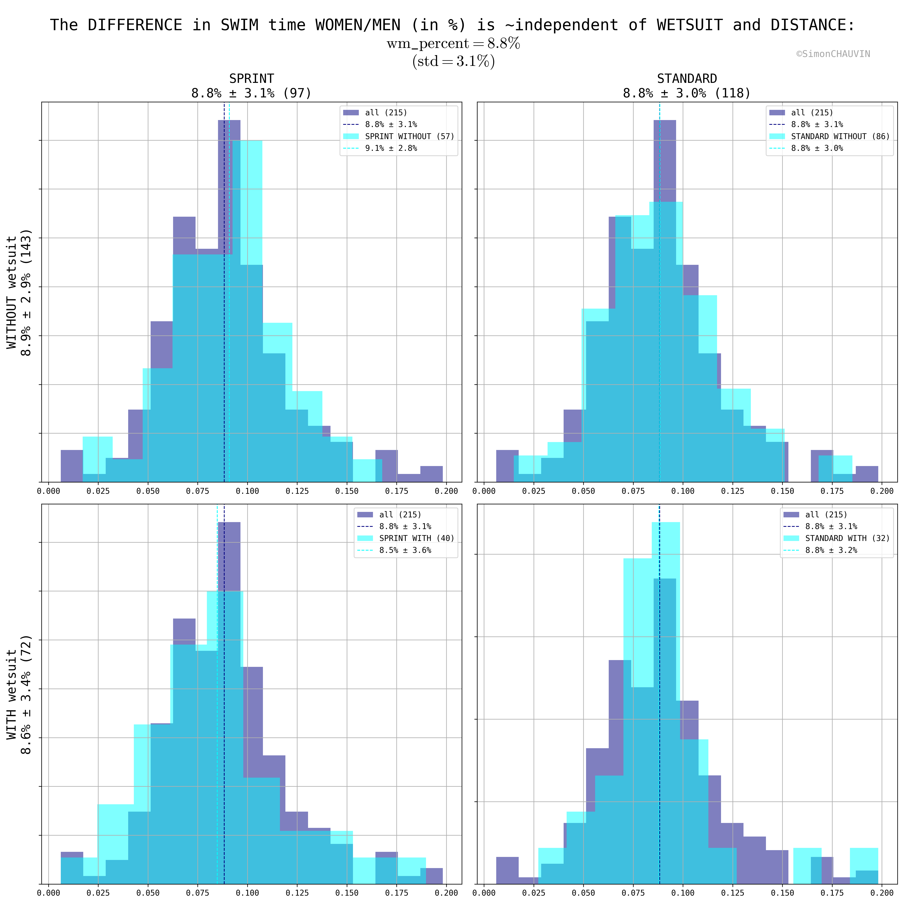                             | 
|:---------------------------------------------------------------------------------------:| 
| *By how much swim women slower, with / without wetsuit? :swimmer: :one_piece_swimsuit:* |

:bulb: **FINDING**:
- The **women/men time difference** can be considered **constant**, **regardless of the distance** (sprint / olympic) and **the equipment** (wetsuit or not): **women swim ~8.8% slower**.
- This result will be used in a [subsequent section](#penguin-wetsuit-benefit) to determine the **benefit provided by the wetsuit**.

---

---

# :swimmer: SWIM GAPS

This section tries to answer the question **_"Should worse swimmers be happy when the wetsuit is allowed?"_**.
- My **_a priori_ reflexion** was:
  - The wetsuit makes everyone swim faster.
  - => The **swim takes less time**.
  - => => **Gaps are smaller**.
  - => => => **Worse swimmers are happy**.

Approach:
- For each race, the gap between the **5-9th top swimmer** and **5-9th worse swimmer** is computed.
- These **gaps are split into two groups**: `with-wetsuit` and `without-wetsuit`.
- The **average gap of both group** are compared to determine **if the wetsuit makes swim gaps smaller or larger**. 

|                          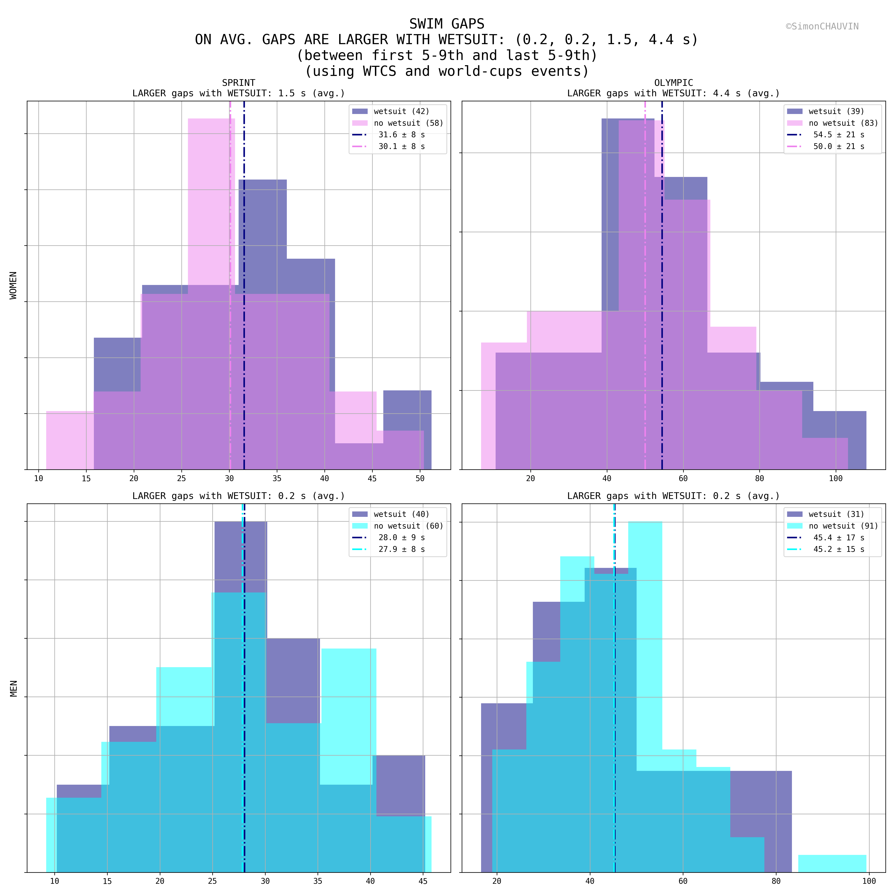                           | 
|:--------------------------------------------------------------------------------------:| 
| *Comparing **average gaps between good and "bad" swimmers** with and without wetsuit.* |

Findings:
- **Variations in the swim-pack length** between **event with-wetsuit and without-wetsuit** are **very small**.
- There is **no evidence** that worse swimmers should be happy about the wetsuit.
  - The **wetsuit even tends to stretch the swim pack**, especially for women. 
  - To be honest, I would have **expected the opposite!**
- How can that be explained?
  - True, the **swim is shorter in time**.
  - Gaps **do not significantly reduce** because the **benefit provided by the wetsuit differs** between good and worse swimmers:
    - For **5-9th** top swimmer: **5.5%**.
    - For **20-24th** top swimmer: **5.2%**.
    - For last **9-5th** top swimmer: **4.9%**.
    - More details on this derivation can be found in the [dedicated section](#penguin-wetsuit-benefit).
  - In other words, despite the shorter swim duration, gaps do not reduce because **top swimmers gain more benefits** from the wetsuit.
- Would the wetsuit enable the **slowest swimmers** (last 9-5th) to **catch the good swimmers** (first 5-9th)?
  - On the olympic format, the **gap is about 50s and 45s** without wetsuit, while the fast women and men swim on average in 19:32 and 17:58.
  - A **4.9% improvement** for the slowest swimmers represent `0.049 * (19:32 + 0:50) =` **60s**, and  `0.049 * (17:58 + 0:45) =` **55s**.
  - Conclusion: the slowest swimmers with the **benefit of the wetsuit** would be **~10s faster that the good swimmers** without.

<details>
  <summary>Click to expand - <strong>Other comparisons.</strong></summary>

---

Considering the **"front-to-middle" distance** (using the **20-24th** swimming times instead of the last 5-9th), results looks similar: **No significant gap reduction**.
- `men`+`sprint`+`no_wetsuit` may suffer from outliers: gaps at Tiszaújváros ( :hungary: ) 2013 and 2016 were >33s.

|                     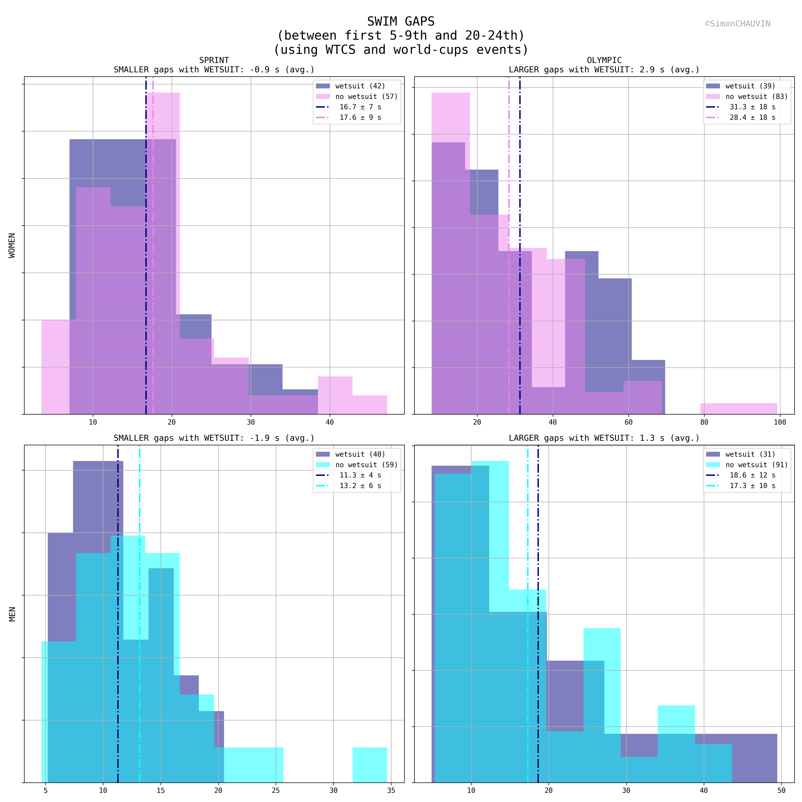                     | 
|:---------------------------------------------------------------------------------------:| 
| *Same computation as above, this time with gaps between 5-9th to **20-24th** swimmers.* |

---

When considering **world-series events only**, the opposite trend occurs: the **wetsuit tends to reduce the swim gaps**.
- However, as noted earlier, **variations are very small**, indicating that **no significant effect of the wetsuit on swim gaps can be concluded**.

| 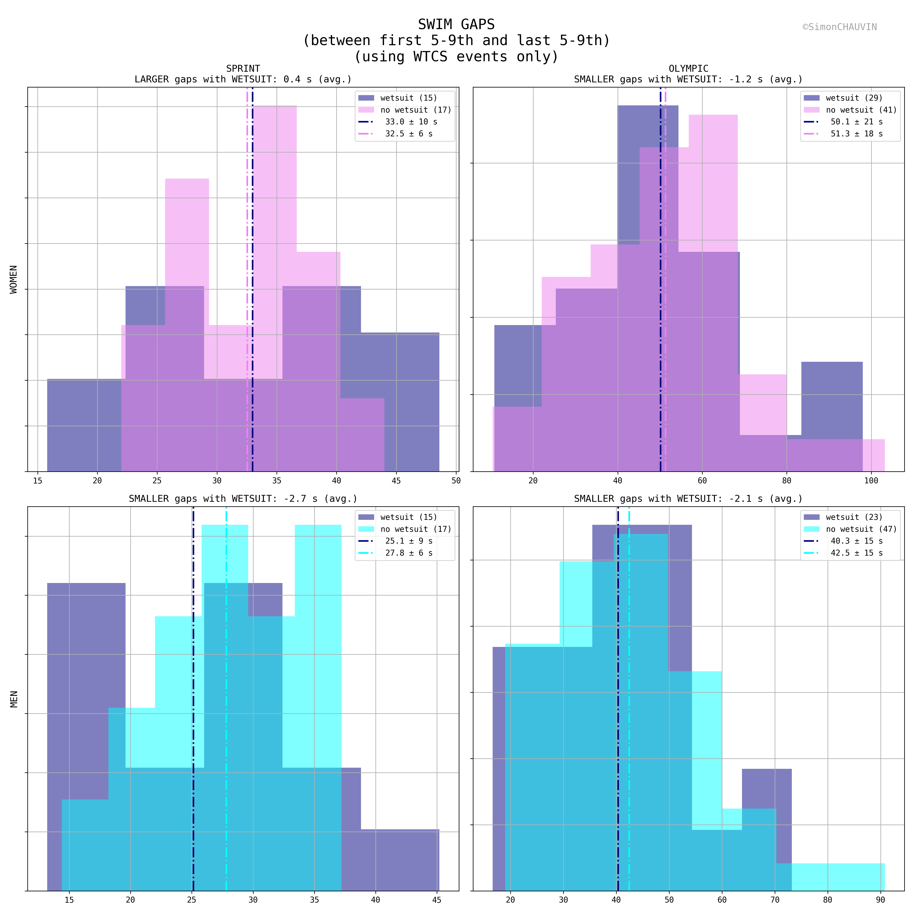 | 
|:-------------------------------------------:| 
|      *With world-series events only.*       |

</details>

---

---

# :penguin: WETSUIT BENEFIT

This section tries to **estimate the benefit (in percent) offered by the wetsuit**, defined as

```
improve_percent = (time_no_wetsuit - time_wetsuit) / time_no_wetsuit

I.e.
time_with_wetsuit = (1 - improve_percent) * time_without_wetsuit
```

Reminder:
- The scope here is **elite triathletes**, going **5-9th** out of water on top ITU events.
- Results would certainly **differ for beginners** and hobby triathletes.

The idea of the **derivation** is as follows:
- **Women [have been found](#focus-on-the-swim-swimmer) to swim on average ~8.8% slower than men**, with the **same equipment**.
- With examples where the **women had the wetsuit**, but the **men did not**, one can:
  - 1- Estimate, from the men time, the **time the women WOULD HAVE done without the wetsuit** (thanks to the ~8.8% rule).
  - 2- Compare the **women's time with wetsuit** (measured) with the **women's time without** (computed in 1-).
  - 3- Deduce the **advantage provided by the wetsuit** for the women.
  - 4- Note that `improve_percent` should be the **same for women and men** (because of the **constant** ~8.8% difference given the **same equipment**).
- Advantage of this method:
  - Men and women swim on the **exact same course**, because the buoys should not move between the two races.
- Limitations: the **swim conditions** are not guaranteed to be equal.
  - For instance in [Cagliari ( :it: ) 2024](https://www.triathlon.org/events/event/2024_world_triathlon_championship_series_cagliari) the **seawater** was [more **choppy** :ocean: for men](https://youtu.be/-Su5kpPz0hY?t=79) than [for women](https://youtu.be/vFV-kB8727I&t=69s).
  - This might be the reason why the gap between men and women is a bit smaller than the average.

<details>
  <summary>Click to expand - ✏️ <strong>Derivation of the formula.</strong></summary>

```
# VARIABLES
  swim_w:             time of women. no wetsuit.
  swim_m:             time of men. no wetsuit.
  swim_w_wet:         time of women. with wetsuit.
  
  improve_percent:    advantate (in percent) brought by the wetsuit. UNKNOWN.
  wm_percent:         relative delay of women over men assuming same equipment.
  wm_percent_w_fast:  relative delay when women have wetsuit, but men do not.

# FORMULA
  would W have not had wetsuit:
    (1)  `swim_w * (1 - improve_percent) = swim_w_wet`  =>  `swim_w = swim_w_wet / (1 - improve_percent)` 
  and this time would be related to swim_m:
    (2)  `swim_w = swim_m * (1 + wm_percent)`
  using (1) == (2):
    (3)  `swim_w_wet = swim_m * (1 + wm_percent) * (1 - improve_percent)`
  
  on the other hand:
    (4)  `swim_w_wet = swim_m * (1 + wm_percent_w_fast)`
  
  using (4) == (3):
    (5)  `(1 + wm_percent) * (1 - improve_percent) = (1 + wm_percent_w_fast)`
  re-written:
         `(1 - improve_percent) = (1 + wm_percent_w_fast) / (1 + wm_percent)`
  hence
         `improve_percent = 1 - (1 + wm_percent_w_fast) / (1 + wm_percent)`

# EXAMPLE
  [wm_percent = 8.8%]
  [wm_percent_w_fast = 2.9%]
  => improve_percent = 1 - (1+0.029)/(1+0.088) = 5.5%

```

</details>

|                                        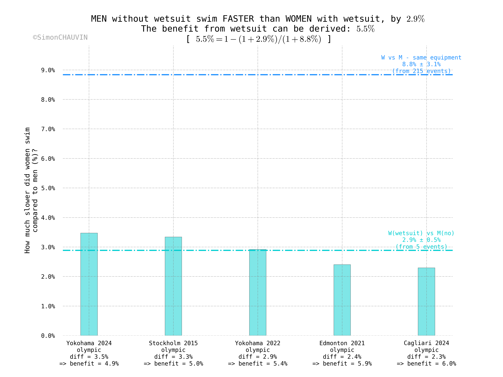                                         | 
|:--------------------------------------------------------------------------------------------------------------:| 
| *Estimating the benefit brought by the wetsuit, using results of races where women swam with but men without.* |

:bulb: **FINDING**:
- The **wetsuit brings an advantage of ~5.5%** to top swimmers (5th-9th).
- To say it other way, top swimmers (top 5-9) swim **~5.8% slower without wetsuit**.
  - `0.055 / (1-0.055) = 0.058`

<details>
  <summary>Click to expand - 🌍 <strong>Events used for the derivation.</strong></summary>

| YEAR |                                                     EVENT                                                      | DIFF (%) WOMEN-WITH vs MEN-WITHOUT | **BENEFIT (%)** | DISTANCE | EVENT CATEGORY |
|:----:|:--------------------------------------------------------------------------------------------------------------:|:----------------------------------:|:---------------:|:--------:|:--------------:|
| 2024 | [Cagliari](https://www.triathlon.org/events/event/2024_world_triathlon_championship_series_cagliari) ( :it: )  |                2.3%                |    **6.0%**     | olympic  |      WTCS      |
| 2021 |   [Edmonton](https://www.triathlon.org/events/event/2021_world_triathlon_grand_final_edmonton) ( :canada: )    |                2.4%                |    **5.9%**     | olympic  |      WTCS      |
| 2022 | [Yokohama](https://www.triathlon.org/events/event/2022_world_triathlon_championship_series_yokohama) ( :jp: )  |                2.9%                |    **5.4%**     | olympic  |      WTCS      |
| 2015 |      [Stockholm](https://www.triathlon.org/events/event/2015_itu_world_triathlon_stockholm) ( :sweden: )       |                3.3%                |    **5.0%**     | olympic  |      WTCS      |
| 2024 | [Yokohama](https://www.triathlon.org/events/event/2023_world_triathlon_championship_series_yokohama1) ( :jp: ) |                3.5%                |    **4.9%**     | olympic  |      WTCS      |

</details>

---

### :mortar_board: Literature review

Here are **some findings of related scientific works**:

- [This 2019 research by Gay et al.](https://pubmed.ncbi.nlm.nih.gov/30958047/) asked 33 swimmers to perform 2×400-m maximal front crawl in a 25-m swimming pool (with wetsuit and swimsuit).
  - The **wetsuit** allows for a **6% improvement** (p < 0.001).
  - Interestingly: _"Swimmers **reduced stroke rate** and **increased stroke length** (by 4%) to benefit from the hydrodynamic reduction of the wetsuit and increase their swimming efficiency."_
- [This 2022 meta study by Gay et al.](https://www.mdpi.com/2673-9488/2/4/16) concludes from 26 studies, a _"**3.2–12.9% velocity increments** in distances ranging from 25 to 1500 m"_ for the **full-body wetsuit**.
  - The range is broad: it depends on many factors such as the **profile of the swimmer** (age, level, triathlete or swimmer), the **swimming conditions** (temperature, 25m pool vs open water) and the **wetsuit** itself.
  - [This interview of Ana Gay in triathlete.com](https://www.triathlete.com/gear/swim/how-much-faster-does-a-wetsuit-make-you-swim/) gives a good introduction to her study.
- [This article from sports-performance-bulletin](https://www.sportsperformancebulletin.com/training/triathlon-clothing-the-benefits-of-wearing-a-wetsuit) reports **improvements by 3% to 7%**.
  - Sources are not explicitly referenced, but the article probably mentions [this 1995 research by Chatard et al.](https://www.researchgate.net/publication/15406796_Wet_suit_effect_A_comparison_between_competitive_swimmers_and_triathletes) which apart from computing improvements, shows that the **impact of the wetsuit** is very different for **competitive swimmers than for competitive triathletes**.

The **5.5% improvement** for top swimmer (5th-9th) **derived from the ITU data** seems **compatible** with the findings of these research publications.

---

### Is the wetsuit worth for 300m?

When they can choose, **pro athletes decide to use the wetsuit** for **~300m swim**, e.g. during **mixed team relay**. Examples:
  - [2018 Nottingham ( :gb: ) ](https://www.triathlon.org/results/result/2018_itu_world_triathlon_mixed_relay_series_nottingham/323321): [video](https://www.youtube.com/watch?v=B4LHN6GeTF4).
  - [2022 Leeds ( :gb: )](https://triathlon.org/results/result/2022_world_triathlon_championship_series_leeds/550671): [pic1](https://triathlon-uploads.imgix.net/webgalleries/163472/tomz2553.jpg) and [pic2](https://triathlon-uploads.imgix.net/webgalleries/163472/tomz2448.jpg)
  - [2023 Sunderland ( :gb: ) ](https://triathlon.org/results/result/2023_world_triathlon_championship_series_sunderland/576189): [video](https://www.youtube.com/watch?v=xufIoKMYlLo). (Here the wetsuit was mandatory: 13.7°C water :cold_face:)

**_Is this decision sound?_**

<details>
  <summary>Click to expand - 🐧 <strong>Answering the question "wetsuit for 300m?"</strong></summary>

Over **300m** a **wetsuit should save ~12s** (derivation below).
- Most of the time, athletes spend **just a bit less than 6s in transition to remove their wetsuit**, and put it correctly into their box.
  - Maybe 4s or 5s when everything goes well? But up to 10s when one leg does not want to get out.
- **Conclusion**: the **overall time gain of wearing the wetsuit for 300m seems to be positive: around 6s**.
  - Apart from time saving, wetsuits offer additional benefits: temperature **comfort** and probably saving some energy in the legs.
- Conversely, assuming an **overall 6s spent** for removal, wearing a **wetsuit is beneficial above ~150m** for top athletes. Under ~150m, time is lost overall.

**Derivation:** The time for a 300m swim is probably **around 3:30 - 4:00**.
- Here are some swim-times measured for 300m, without wetsuit:
  - The 5-th **man** out of water was at **~3:35** at [2024 Hamburg ( :de: )](https://youtu.be/WyfYD2wsHPg?t=76) during the first leg.
  - The 5-th **man** out of water was at **~3:37** at [2023 Hamburg ( :de: )](https://youtu.be/nJ4sm5ULXj8?t=1322) during the first leg.
  - The 5-th **man** was at **~3:41** at [2023 Super-Sprint Hamburg ( :de: )](https://triathlon.org/results/result/2023_world_triathlon_sprint_relay_championships_hamburg/582516) .
  - The 5-th **women** was at **~3:46** at [2021 Tokyo ( :jp: )](https://youtu.be/oQQEa_je2Vg?t=777).
  - The 5-th **women** was at **~3:58** at [2018 Hamburg ( :de: )](https://youtu.be/oAwzJnX44Yg?t=42).
  - The 5-th **woman** was at **~4:05** at [2023 Super-Sprint Hamburg ( :de: )](https://triathlon.org/results/result/2023_world_triathlon_sprint_relay_championships_hamburg/582517).
- Variations occur depending on the **actual swim distance** (buoys positions) and the **position of the timing mat**.
- Considering the broad **range (3:30 - 4:00)** seems relevant.
  - For the (3:30 - 4:00) range, the **5.5% gain** offered by the wetsuit leads to a **~12s saving**.

| Benefit | 03:30 | 03:35 |  03:40   |  03:45   |  03:50   | 03:55 | 04:00 | 04:05 | 04:10 |
|:-------:|:-----:|:-----:|:--------:|:--------:|:--------:|:-----:|:-----:|:-----:|:-----:|
|  5.0%   | 10.5  | 10.8  |   11.0   |   11.2   |   11.5   | 11.8  | 12.0  | 12.2  | 12.5  |
|  5.2%   | 10.9  | 11.2  |   11.4   |   11.7   |   12.0   | 12.2  | 12.5  | 12.7  | 13.0  |
|  5.4%   | 11.3  | 11.6  | **11.9** | **12.2** | **12.4** | 12.7  | 13.0  | 13.2  | 13.5  |
|  5.6%   | 11.8  | 12.0  | **12.3** | **12.6** | **12.9** | 13.2  | 13.4  | 13.7  | 14.0  |
|  5.8%   | 12.2  | 12.5  |   12.8   |   13.1   |   13.3   | 13.6  | 13.9  | 14.2  | 14.5  |
|  6.0%   | 12.6  | 12.9  |   13.2   |   13.5   |   13.8   | 14.1  | 14.4  | 14.7  | 15.0  |
|  6.2%   | 13.0  | 13.3  |   13.6   |   14.0   |   14.3   | 14.6  | 14.9  | 15.2  | 15.5  |
|  6.4%   | 13.4  | 13.8  |   14.1   |   14.4   |   14.7   | 15.0  | 15.4  | 15.7  | 16.0  |
|  6.6%   | 13.9  | 14.2  |   14.5   |   14.9   |   15.2   | 15.5  | 15.8  | 16.2  | 16.5  |
|  6.8%   | 14.3  | 14.6  |   15.0   |   15.3   |   15.6   | 16.0  | 16.3  | 16.7  | 17.0  |
|  7.0%   | 14.7  | 15.1  |   15.4   |   15.8   |   16.1   | 16.5  | 16.8  | 17.2  | 17.5  |

</details>

---

The benefit of the wetsuit could be estimated with a second method (less reliable):

<details>
  <summary>Click to expand - <strong>Second approach.</strong></summary>

|             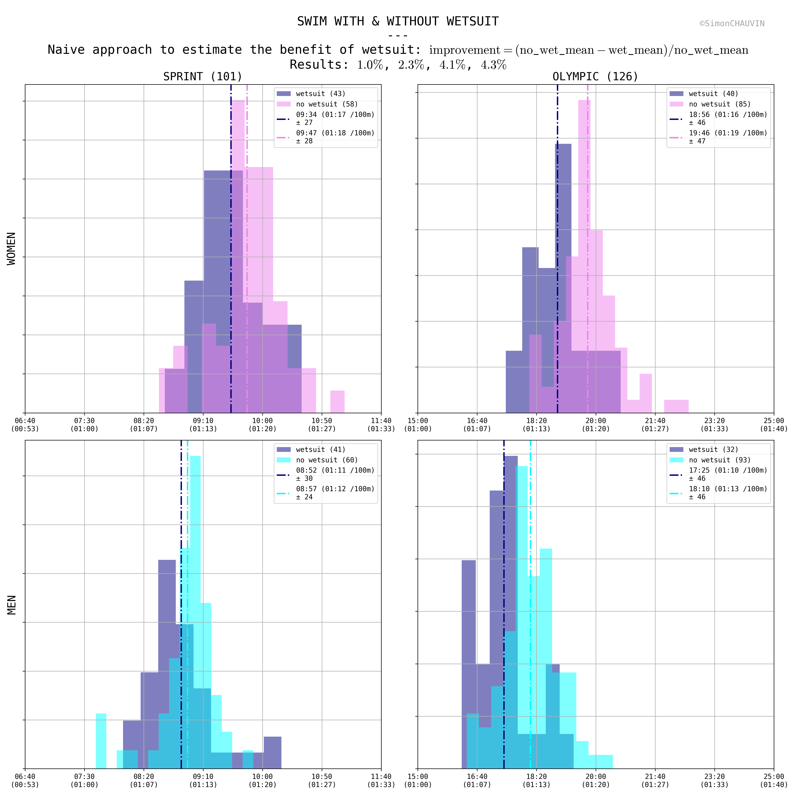              | 
|:------------------------------------------------------------:| 
|   *Comparing duration of swims with and without wetsuit.*    |

The idea is to compute `improve_percent = (time_no_wetsuit - time_wetsuit) / time_no_wetsuit` with `time_wetsuit` and `time_no_wetsuit` being the **average swim durations** with- and without wetsuit, **using all race results**.

This method leverages **more data**, but its results are **less reliable** since the **swim course distances differ**:
- For instance, the difference between the fastest and the slowest `sprint`+`men`+`same-equipment` swim is more than 2min. In particular **Mooloolaba** ( :australia: ) swim times (without wetsuit) are **unusually low**.
- The difference for `olympic`+`men`+`no-wetsuit` is 5min45s.
- Clearly **swim distances**, or **how swim times are measured**, **differ** despite being given the **same format**.

Outliers:
- The swim of [2012 Mooloolaba ITU Triathlon World Cup ( :australia: )](https://www.triathlon.org/events/event/2012_mooloolaba_itu_triathlon_world_cup) has been dropped - see the previous section about [T1](#T1).
- The **slowest swim** on the olympic format without wetsuit are for both men and women the **Paris 2024 Olympic Games** ( :fr: ).

</details>

---

---

# :dart: RACE SCENARIO

This section looks at the race dynamics, based on the information **"does a bunch manages to breakaway on the bike?"** :bird:

To obtain this information, the **size** of the **front pack** at the **end of the bike** is estimated as follows:
- Compute for each athlete the cumulative times after the bike:
  - `start_to_t2 = swim + t1 + bike`.
- Identify which athlete enters T2 first: `min(start_to_t2)`.
- Count how many athletes enter T2 **`pack_duration_s`, e.g. 10s, or less** after this first athlete.
- This gives the **size of the front pack** at the **end of the bike**.

Note: A **breakaway** on the bike can happen:
- Either by **attack and escape from the main bike pack** (very rare).
- Or **directly from the swim** (most common).
- It should be possible to automatically retrieve the **breakaway type** among the two, using the swim rank of athletes composing the breakaway. _(I have not done it)_.

Two additional pieces of information are retrieved:
- **`winner_in_front_pack`**: was the **winner already in the leading group** at the end of the bike, or did she/he **come back on the run**? :trophy:
- **`is_best_runner_in_front_pack`**.

|       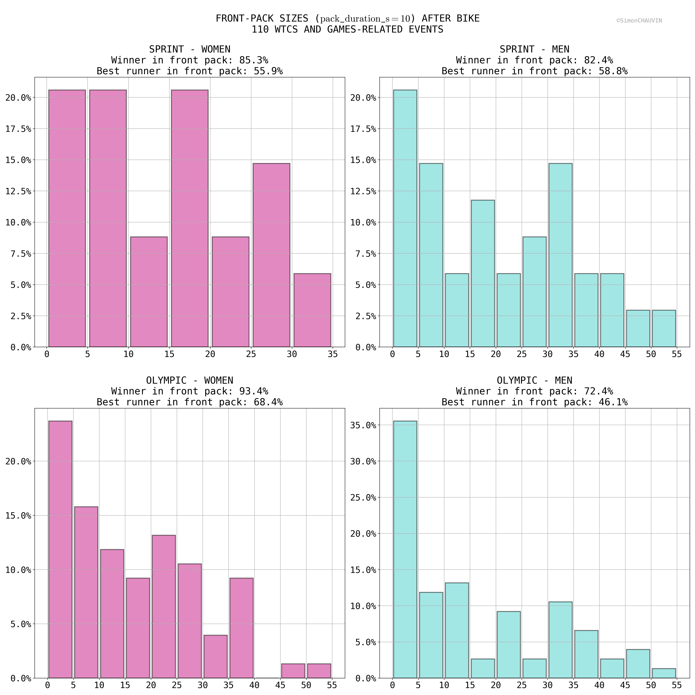        | 
|:------------------------------------------------:| 
| *Size of the front pack at the end of the bike.* |

On the **olympic** format, **men are more likely to break away**.
- Because they are stronger on the bike?
  - Georgia Taylor-Brown ( :gb: ), **one of the strongest rider** in the field, admits in [this video](https://youtu.be/8dvcwuT2T_8?t=1251): **_"I would love to be able to attack and stay away, but I do not have that power."_**
  - Probably bike is the sport among three where **top athletes will progress the most** in the future.
- At the same time, the **probability to win** for athletes in the front group is **much lower than for women**.

Small front packs, i.e. **small breakaways**, are more likely on the **olympic format**.
- Possibly because a **longer swim** leads to **larger gaps** at **t1**?
- On the other hand the bike is longer than for the sprint format, which **should give more time** for the other packs to catch up. 

<details>
  <summary>Click to expand - :muscle: <strong>Some wins via breakaway (with front-pack-size <= 3).</strong></summary>

|  pack_size  |  year  |               winner                |  distance  |    cat    |                                                                                                 event                                                                                                  |
|:-----------:|:------:|:-----------------------------------:|:----------:|:---------:|:------------------------------------------------------------------------------------------------------------------------------------------------------------------------------------------------------:|
|      1      |  2011  |       Sarah Haskins ( :us: )        |  OLYMPIC   | WORLD-CUP |                                  [2011 Monterrey ITU Triathlon World Cup ( :mexico: )](https://www.triathlon.org/events/event/2011_monterrey_itu_triathlon_world_cup)                                  |
|      1      |  2016  |      Flora Duffy ( :bermuda: )      |  OLYMPIC   |   WTCS    |                                      [2016 ITU World Triathlon Stockholm ( :sweden: )](https://www.triathlon.org/events/event/2016_itu_world_triathlon_stockholm)                                      |
|      1      |  2018  |      Flora Duffy ( :bermuda: )      |  OLYMPIC   |   WTCS    |                                       [2018 ITU World Triathlon Bermuda ( :bermuda: )](https://www.triathlon.org/events/event/2018_itu_world_triathlon_bermuda)                                        |
|      1      |  2021  |        Taylor Knibb ( :us: )        |  OLYMPIC   |   WTCS    |                           [2021 World Triathlon Championship Finals Edmonton ( :canada: )](https://www.triathlon.org/events/event/2021_world_triathlon_grand_final_edmonton)                           |
|      2      |  2011  |   Nicky Samuels ( :new_zealand: )   |  OLYMPIC   | WORLD-CUP |                               [2011 Mooloolaba ITU Triathlon World Cup ( :australia: )](https://www.triathlon.org/events/event/2011_mooloolaba_itu_triathlon_world_cup)                                |
|      2      |  2017  |      Flora Duffy ( :bermuda: )      |  OLYMPIC   |   WTCS    |                                         [2017 ITU World Triathlon Yokohama ( :jp: )](https://www.triathlon.org/events/event/2017_itu_world_triathlon_yokohama)                                         |
|      2      |  2021  |        Taylor Knibb ( :us: )        |  OLYMPIC   |   WTCS    |                                   [2021 World Triathlon Championship Series Yokohama ( :jp: )](https://www.triathlon.org/events/event/2021_world_triathlon_yokohama)                                   |
|      2      |  2022  |      Flora Duffy ( :bermuda: )      |  OLYMPIC   |   WTCS    |                       [2022 World Triathlon Championship Series Bermuda ( :bermuda: )](https://www.triathlon.org/events/event/2022_world_triathlon_championship_series_bermuda)                        |
|      3      |  2009  |    Emma Moffatt ( :australia: )     |  OLYMPIC   |   WTCS    |      [2009 Dextro Energy Triathlon - ITU World Championship Series Hamburg ( :de: )](https://www.triathlon.org/events/event/2009_dextro_energy_triathlon_-_itu_world_championship_series_hamburg)      |
|      3      |  2014  |       Jodie Stimpson ( :gb: )       |  OLYMPIC   |   WTCS    |                                    [2014 ITU World Triathlon Auckland ( :new_zealand: )](https://www.triathlon.org/events/event/2014_itu_world_triathlon_auckland)                                     |
|      3      |  2016  |       Helen Jenkins ( :gb: )        |  OLYMPIC   |   WTCS    |                                   [2016 ITU World Triathlon Gold Coast ( :australia: )](https://www.triathlon.org/events/event/2016_itu_world_triathlon_gold_coast)                                    |
|      3      |  2016  |      Flora Duffy ( :bermuda: )      |  OLYMPIC   |   WTCS    |                            [2016 ITU World Triathlon Grand Final Cozumel ( :mexico: )](https://www.triathlon.org/events/event/2016_itu_world_triathlon_grand_final_cozumel)                            |
|      3      |  2017  |      Flora Duffy ( :bermuda: )      |  OLYMPIC   |   WTCS    |                       [2017 ITU World Triathlon Grand Final Rotterdam ( :netherlands: )](https://www.triathlon.org/events/event/2017_itu_world_triathlon_grand_final_rotterdam)                        |
|      3      |  2019  |       Katie Zaferes ( :us: )        |  OLYMPIC   |   WTCS    |                                  [2019 MS Amlin World Triathlon Bermuda ( :bermuda: )](https://www.triathlon.org/events/event/2019_ms_amlin_world_triathlon_bermuda)                                   |
|      3      |  2019  |   Julie Derron ( :switzerland: )    |  OLYMPIC   | WORLD-CUP |                                       [2019 Weihai ITU Triathlon World Cup ( :cn: )](https://www.triathlon.org/events/event/2019_weihai_itu_triathlon_world_cup)                                       |
|      3      |  2021  |    Maya Kingma ( :netherlands: )    |  OLYMPIC   |   WTCS    |                                  [AJ Bell 2021 World Triathlon Championship Series Leeds ( :gb: )](https://www.triathlon.org/events/event/2021_world_triathlon_leeds)                                  |
|      3      |  2024  |        Lena Meißner ( :de: )        |  OLYMPIC   | WORLD-CUP |                                    [2024 World Triathlon Cup Samarkand ( :uzbekistan: )](https://www.triathlon.org/events/event/2024_world_triathlon_cup_samarkand)                                    |
|     ...     |  ...   |                 ...                 |    ...     |    ...    |                                                                                                  ...                                                                                                   |
|      1      |  2013  |     Alistair Brownlee ( :gb: )      |  OLYMPIC   |   WTCS    |                                      [2013 ITU World Triathlon Stockholm ( :sweden: )](https://www.triathlon.org/events/event/2013_itu_world_triathlon_stockholm)                                      |
|      1      |  2018  |     Casper Stornes ( :norway: )     |  OLYMPIC   |   WTCS    |                                       [2018 ITU World Triathlon Bermuda ( :bermuda: )](https://www.triathlon.org/events/event/2018_itu_world_triathlon_bermuda)                                        |
|      1      |  2023  |       Morgan Pearson ( :us: )       |  OLYMPIC   | WORLD-CUP |                               [2023 World Triathlon Cup Karlovy Vary ( :czech_republic: )](https://www.triathlon.org/events/event/2023_world_triathlon_cup_karlovy_vary)                               |
|      2      |  2011  |   Kris Gemmell ( :new_zealand: )    |  OLYMPIC   | WORLD-CUP |                                [2011 Auckland ITU Triathlon World Cup ( :new_zealand: )](https://www.triathlon.org/events/event/2011_auckland_itu_triathlon_world_cup)                                 |
|      2      |  2016  | Rodrigo Gonzalez Lopez ( :mexico: ) |  OLYMPIC   | WORLD-CUP |                                      [2016 Chengdu ITU Triathlon World Cup ( :cn: )](https://www.triathlon.org/events/event/2016_chengdu_itu_triathlon_world_cup)                                      |
|      3      |  2009  |        Jan Frodeno ( :de: )         |  OLYMPIC   |   WTCS    |     [2009 Dextro Energy Triathlon - ITU World Championship Series Yokohama ( :jp: )](https://www.triathlon.org/events/event/2009_dextro_energy_triathlon_-_itu_world_championship_series_yokohama)     |
|      3      |  2011  |     Alistair Brownlee ( :gb: )      |  OLYMPIC   |   WTCS    | [2011 Dextro Energy Triathlon - ITU World Championship Series Kitzbuehel ( :austria: )](https://www.triathlon.org/events/event/2011_dextro_energy_triathlon_-_itu_world_championship_series_kitzbuhel) |
|      3      |  2014  |     Alistair Brownlee ( :gb: )      |  OLYMPIC   |   WTCS    |                           [2014 ITU World Triathlon Grand Final Edmonton ( :canada: )](https://www.triathlon.org/events/event/2014_itu_world_triathlon_grand_final_edmonton)                           |
|      3      |  2015  |     Jonathan Brownlee ( :gb: )      |  OLYMPIC   |   WTCS    |                                   [2015 ITU World Triathlon Gold Coast ( :australia: )](https://www.triathlon.org/events/event/2015_itu_world_triathlon_gold_coast)                                    |
|      3      |  2020  |        Vincent Luis ( :fr: )        |  OLYMPIC   | WORLD-CUP |                           [2020 Karlovy Vary ITU Triathlon World Cup ( :czech_republic: )](https://www.triathlon.org/events/event/2020_karlovy_vary_itu_triathlon_world_cup)                           |

Strong bikers and **very versatile** triathletes! :clap:
- Especially **Flora Duffy** ( :bermuda: ) and **Alistair Brownlee** ( :gb: ).

</details>

---

Below is a more complicated figure: it shows the evolution of the **first-pack size** over the years.

| 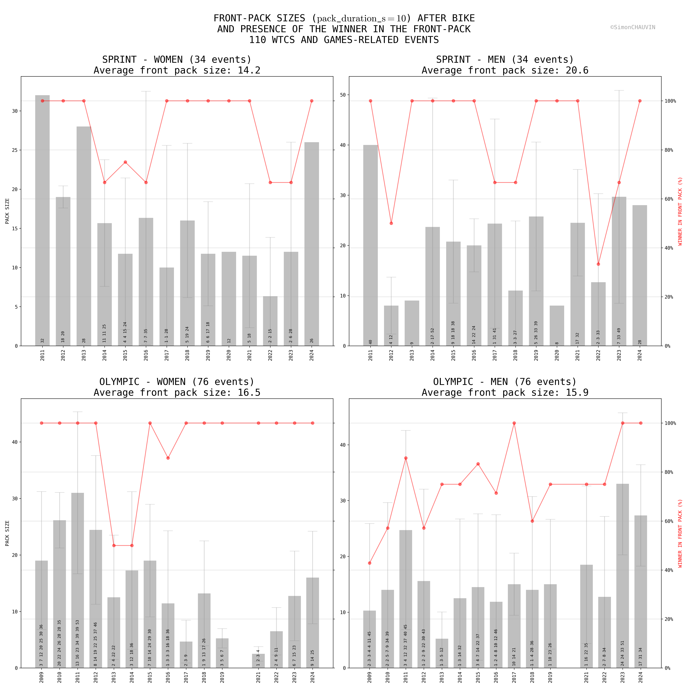 | 
|:---------------------------------------------------------:| 
|        *Size of front bike pack, over the years.*         |

**Run-comebacks**, i.e. winning after not being in the front group after bike, are **rare**.
- Apart from 2013-2016 (Gwen Jorgensen era), **no comeback has happened on women's olympic races** and only a few on women's sprint format.
  - At the same time, the size of **front-pack had reduced until 2022** and was even very small for some recent years (2017, 2019, 2021, 2022).
  - Now, **top-swimmer** can **ride hard** and **run fast**.
- Helen Jenkins ( :gb: ) explains in [this 2024 video](https://youtu.be/QwCUmvPCjw4?t=338): "Women's races have definitely changed over the past few years. (...) **2021 was that breakaway era**. It definitely **comes back** to that **larger front group** over the last couple of years."
  - That statement is perfectly **consistent** with the women's olympic bar plot.

---

### :runner: How often does the best runner win? :trophy:

| 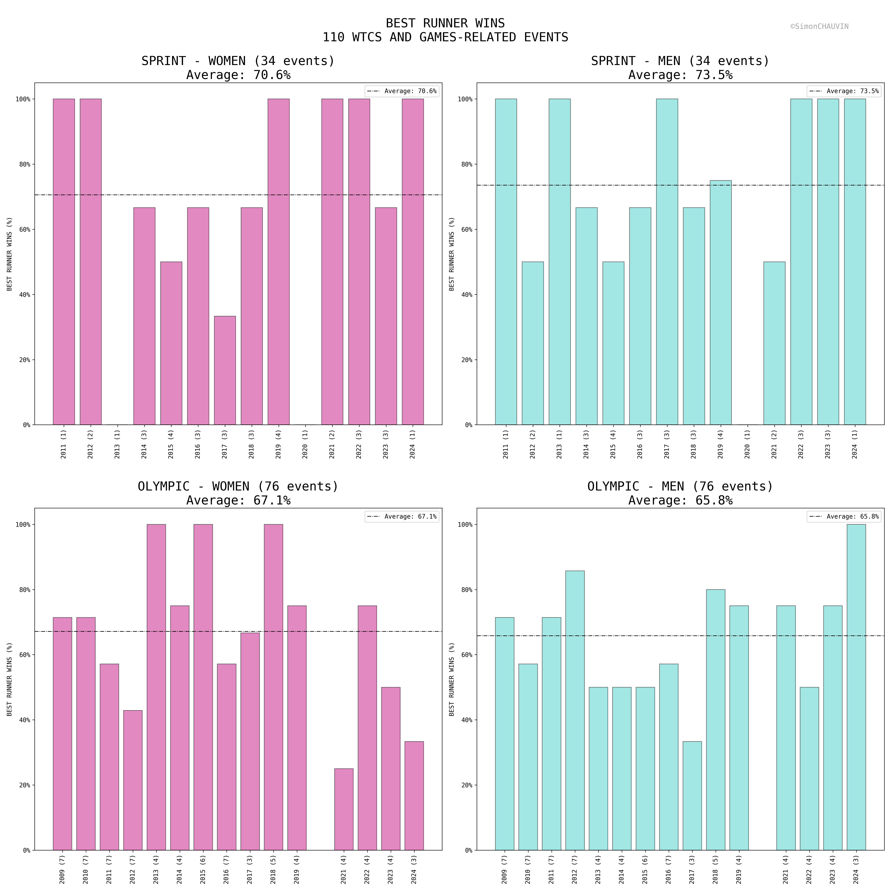 | 
|:-------------------------------------------------:| 
|       *How often does the best runner win?*       |

More than **2/3 races** are **won by the best runner**.
- This percentage is higher on the **sprint** than on the **olympic** format.
  - Probably because the swim is shorter: "good-runner-but-bad-swimmer"s are **less likely to miss the front group** on the bike.
- This percentage could be:
  - Higher, if the winner does not slow down and **"enjoy" the last 100m run**, and instead sprints until the end, as most athletes behind have to.
  - Lower, if good runners who, at t2, are already too far for the win, **get as motivated** as the athletes at the front, and give their best possible run.
- The percentage **drops to 50%** when considering **world-cup** events only. Why?
  - Because athletes are **not as complete as on WTCS**?
  - There are **more "good-runner-but-bad-swimmer"s** who miss the front group on the bike, while good swimmers are not top runners?

<details>
  <summary>Click to expand - <strong>Same plots for world-cup events only.</strong></summary>

|               | 
|:------------------------------------------------:| 
| *Size of the front pack at the end of the bike.* |

| 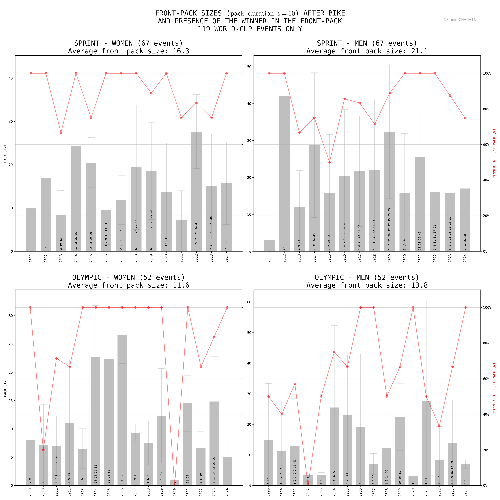 | 
|:------------------------------------------------------------:| 
|          *Size of front bike pack, over the years.*          |

| 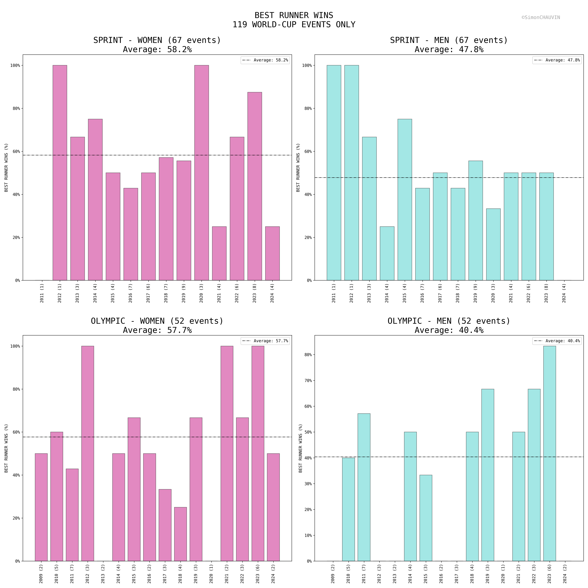 | 
|:-------------------------------------------------------:| 
|         *How often does the best runner wins?*          |

</details>

---

Why are there not **more breakaways** on the bike?
- The **mini areo TT bars** [have been banned](https://www.slowtwitch.com/Lifestyle/An_Athlete_s_Perspective_on_2022_World_Triathlon_Rules_8217.html) in 2023.
- Bike courses are **mostly flat**.
  - Events often take place on flat coasts, near to a sea, or in **flat big cities**.
- Because of **U-turns**.
  - As Michel Hidalgo ( :brazil: ) [explains in this video](https://youtu.be/8dvcwuT2T_8?t=780), **U-turns can be detrimental for breakaways**.
- Athletes may prefer to conserve energy for the **run segment**.
  - Valid of strong runners.
  - But for others? Maybe it is **worth more** to **conserve energy by drafting** and try to make top-20 with a good run, rather than risk a breakaway that might be caught, be burnt and **come back home without any prize money**?
- Not enough bike power?
  - Possibly, given these athletes need to be strong in swim and run as well, they cannot **afford having massive legs**.

---

---

# :rocket: SPRINT FINISH

This section studies the **time gap between the winner and the second**.

|  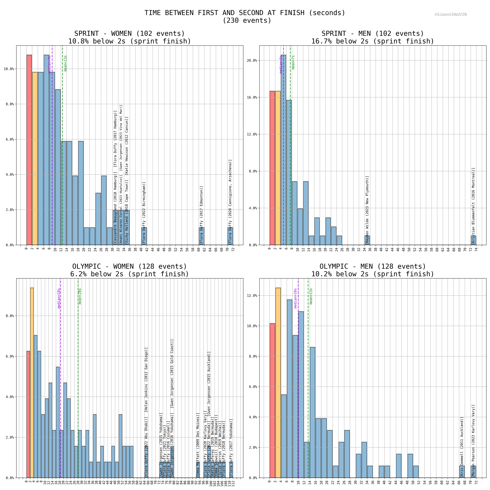  | 
|:---------------------------------------------:| 
| *Time gap between the winner and the second.* |

- Wins for **men races** are more often decided by a **sprint finish** (+50%).
- Women's races offer **examples of wins by very large margins**.

|                                                   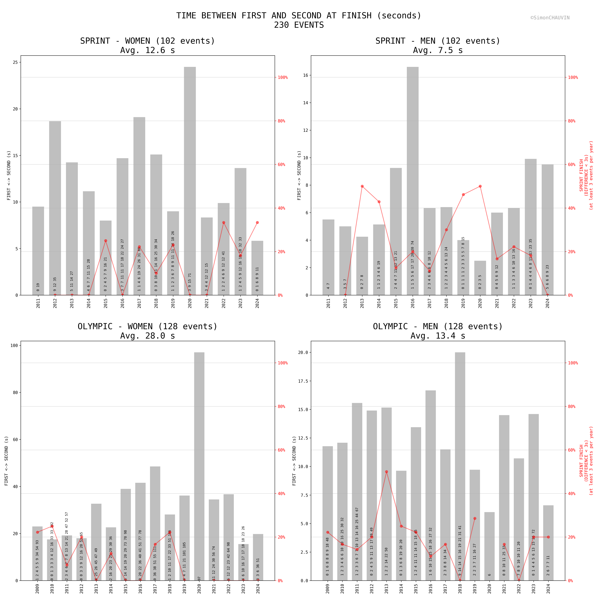                                                    | 
|:----------------------------------------------------------------------------------------------------------------------------------------------------------------------:| 
| *Time gap between the winner and the second, over years. And the proportion of events with a contested win finish (less than 3s difference between first and second).* |

Gaps **between the winner and the second** are on average:
- **~Twice as large** in **olympic** formats compared to **sprint** formats.
- **~Twice as large** for **women** compared to **men**.

<details>
  <summary>Click to expand - 📸 <strong>Some of the most contested finishes on the blue carpet.</strong></summary>

##### WOMEN

|                                                        YEAR                                                         |                                                                VENUE                                                                 |  DIST.  | RACE CATEGORY |      FIRST ( :1st_place_medal: )      |         SECOND ( :2nd_place_medal: )         |
|:-------------------------------------------------------------------------------------------------------------------:|:------------------------------------------------------------------------------------------------------------------------------------:|:-------:|:-------------:|:-------------------------------------:|:--------------------------------------------:|
| [2009](https://www.triathlon.org/events/event/2009_dextro_energy_triathlon_-_itu_world_championship_series_madrid1) |    [Madrid](https://www.triathlon.org/events/event/2009_dextro_energy_triathlon_-_itu_world_championship_series_madrid1) ( :es: )    | olympic |     WTCS      |    Andrea Hansen ( :new_zealand: )    |           Lisa Norden ( :sweden: )           |
| [2010](https://www.triathlon.org/events/event/2010_dextro_energy_triathlon_-_itu_world_championship_series_hamburg) |   [Hamburg](https://www.triathlon.org/events/event/2010_dextro_energy_triathlon_-_itu_world_championship_series_hamburg) ( :de: )    | olympic |     WTCS      |       Lisa Norden ( :sweden: )        |         Emma Moffatt ( :australia: )         |
| [2010](https://www.triathlon.org/events/event/2010_dextro_energy_triathlon_-_itu_world_championship_series_sydney)  | [Sydney](https://www.triathlon.org/events/event/2010_dextro_energy_triathlon_-_itu_world_championship_series_sydney) ( :australia: ) | olympic |     WTCS      |      Barbara Riveros ( :chile: )      |       Andrea Hansen ( :new_zealand: )        |
|              [2010](https://www.triathlon.org/events/event/2010_tiszaujvaros_itu_triathlon_world_cup)               |            [Tiszaujvaros](https://www.triathlon.org/events/event/2010_tiszaujvaros_itu_triathlon_world_cup) ( :hungary: )            | olympic |   world-cup   |   Yuliya Yelistratova ( :ukraine: )   |            Jodie Swallow ( :gb: )            |
|     [2011](https://www.triathlon.org/events/event/2011_lausanne_itu_elite_sprint_triathlon_world_championships)     |  [Lausanne](https://www.triathlon.org/events/event/2011_lausanne_itu_elite_sprint_triathlon_world_championships) ( :switzerland: )   | sprint  |     WTCS      |      Barbara Riveros ( :chile: )      |         Emma Jackson ( :australia: )         |
|                  [2012](https://www.triathlon.org/events/event/2012_itu_world_triathlon_yokohama)                   |                    [Yokohama](https://www.triathlon.org/events/event/2012_itu_world_triathlon_yokohama) ( :jp: )                     | olympic |     WTCS      |       Lisa Norden ( :sweden: )        |              Anne Haug ( :de: )              |
|                      [2012](https://www.triathlon.org/events/event/2012_london_olympic_games)                       |                         [London](https://www.triathlon.org/events/event/2012_london_olympic_games) ( :gb: )                          | olympic |     games     |    Nicola Spirig ( :switzerland: )    |           Lisa Norden ( :sweden: )           |
|              [2015](https://www.triathlon.org/events/event/2015_tiszaujvaros_itu_triathlon_world_cup)               |            [Tiszaujvaros](https://www.triathlon.org/events/event/2015_tiszaujvaros_itu_triathlon_world_cup) ( :hungary: )            | sprint  |   world-cup   | Felicity Sheedy-Ryan ( :australia: )  |            Audrey Merle ( :fr: )             |
|                [2017](https://www.triathlon.org/events/event/2017_cape_town_itu_triathlon_world_cup)                |            [Cape Town](https://www.triathlon.org/events/event/2017_cape_town_itu_triathlon_world_cup) ( :south_africa: )             | sprint  |   world-cup   |       Lucy Buckingham ( :gb: )        |          Jessica Learmonth ( :gb: )          |
|                  [2017](https://www.triathlon.org/events/event/2017_itu_world_triathlon_abu_dhabi)                  |          [Abu Dhabi](https://www.triathlon.org/events/event/2017_itu_world_triathlon_abu_dhabi) ( :united_arab_emirates: )           | olympic |     WTCS      |    Andrea Hansen ( :new_zealand: )    |           Jodie Stimpson ( :gb: )            |
|              [2017](https://www.triathlon.org/events/event/2017_new_plymouth_itu_triathlon_world_cup)               |          [New Plymouth](https://www.triathlon.org/events/event/2017_new_plymouth_itu_triathlon_world_cup) ( :new_zealand: )          | sprint  |   world-cup   |        Katie Zaferes ( :us: )         |          Joanna Brown ( :canada: )           |
|                [2018](https://www.triathlon.org/events/event/2018_cagliari_itu_triathlon_world_cup)                 |                  [Cagliari](https://www.triathlon.org/events/event/2018_cagliari_itu_triathlon_world_cup) ( :it: )                   | sprint  |   world-cup   |      Lisa Perterer ( :austria: )      |            Taylor Spivey ( :us: )            |
|              [2018](https://www.triathlon.org/events/event/2018_karlovy_vary_itu_triathlon_world_cup)               |        [Karlovy Vary](https://www.triathlon.org/events/event/2018_karlovy_vary_itu_triathlon_world_cup) ( :czech_republic: )         | olympic |   world-cup   | Vendula Frintova ( :czech_republic: ) |         Kaidi Kivioja ( :estonia: )          |
|                 [2019](https://www.triathlon.org/events/event/2019_madrid_itu_triathlon_world_cup)                  |                    [Madrid](https://www.triathlon.org/events/event/2019_madrid_itu_triathlon_world_cup) ( :es: )                     | sprint  |   world-cup   |        Emilie Morier ( :fr: )         |            Sandra Dodet ( :fr: )             |
|              [2019](https://www.triathlon.org/events/event/2019_tiszaujvaros_itu_triathlon_world_cup)               |           [Tiszaujvaros ](https://www.triathlon.org/events/event/2019_tiszaujvaros_itu_triathlon_world_cup) ( :hungary: )            | sprint  |   world-cup   |     Emma Jeffcoat ( :australia: )     |           Sara Vilic ( :austria: )           |
|                   [2022](https://www.triathlon.org/events/event/2022_world_triathlon_cup_bergen)                    |                    [Bergen](https://www.triathlon.org/events/event/2022_world_triathlon_cup_bergen) ( :norway: )                     | sprint  |   world-cup   |      Tilda Månsson ( :sweden: )       |        Jolien Vermeylen ( :belgium: )        |
|                [2023](https://www.triathlon.org/events/event/2023_world_triathlon_cup_tiszaujvaros)                 |              [Tiszaujvaros](https://www.triathlon.org/events/event/2023_world_triathlon_cup_tiszaujvaros) ( :hungary: )              | sprint  |   world-cup   |      Tilda Månsson ( :sweden: )       |             Noelia Juan ( :es: )             |
|                  [2024](https://www.triathlon.org/events/event/2024_world_triathlon_cup_huatulco)                   |                  [Huatulco](https://www.triathlon.org/events/event/2024_world_triathlon_cup_huatulco) ( :mexico: )                   | sprint  |   world-cup   |  Alberte Kjær Pedersen ( :denmark: )  |       Rachel Klamer ( :netherlands: )        |
|                 [2024](https://www.triathlon.org/events/event/2024_world_triathlon_cup_wollongong)                  |               [Wollongong](https://www.triathlon.org/events/event/2024_world_triathlon_cup_wollongong) ( :australia: )               | sprint  |   world-cup   |      Tilda Månsson ( :sweden: )       | Maria Carolina Velasquez Soto ( :colombia: ) |

##### MEN

|                                                         YEAR                                                          |                                                                VENUE                                                                |  DIST.  | RACE CATEGORY |    FIRST ( :1st_place_medal: )    |    SECOND ( :2nd_place_medal: )    |
|:---------------------------------------------------------------------------------------------------------------------:|:-----------------------------------------------------------------------------------------------------------------------------------:|:-------:|:-------------:|:---------------------------------:|:----------------------------------:|
| [2009](https://www.triathlon.org/events/event/2009_dextro_energy_triathlon_-_itu_world_championship_series_tongyeong) | [Tongyeong](https://www.triathlon.org/events/event/2009_dextro_energy_triathlon_-_itu_world_championship_series_tongyeong) ( :kr: ) | olympic |     WTCS      | Bevan Docherty ( :new_zealand: )  |  Brad Kahlefeldt ( :australia: )   |
|                  [2009](https://www.triathlon.org/events/event/2009_hy-vee_itu_triathlon_elite_cup)                   |                  [Des Moines](https://www.triathlon.org/events/event/2009_hy-vee_itu_triathlon_elite_cup) ( :us: )                  | olympic |   world-cup   |   Simon Whitfield ( :canada: )    |  Brad Kahlefeldt ( :australia: )   |
|   [2010](https://www.triathlon.org/events/event/2010_dextro_energy_triathlon_-_itu_world_championship_series_seoul)   |     [Seoul](https://www.triathlon.org/events/event/2010_dextro_energy_triathlon_-_itu_world_championship_series_seoul) ( :kr: )     | olympic |     WTCS      |       Jan Frodeno ( :de: )        | Courtney Atkinson ( :australia: )  |
|  [2011](https://www.triathlon.org/events/event/2011_dextro_energy_triathlon_-_itu_world_championship_series_hamburg)  |   [Hamburg](https://www.triathlon.org/events/event/2011_dextro_energy_triathlon_-_itu_world_championship_series_hamburg) ( :de: )   | olympic |     WTCS      |  Brad Kahlefeldt ( :australia: )  |      William Clarke ( :gb: )       |
|                [2012](https://www.triathlon.org/events/event/2012_mooloolaba_itu_triathlon_world_cup)                 |            [Mooloolaba](https://www.triathlon.org/events/event/2012_mooloolaba_itu_triathlon_world_cup) ( :australia: )             | olympic |   world-cup   |      Laurent Vidal ( :fr: )       |  Brad Kahlefeldt ( :australia: )   |
|              [2013](https://www.triathlon.org/events/event/2013_itu_world_triathlon_grand_final_london)               |                [London](https://www.triathlon.org/events/event/2013_itu_world_triathlon_grand_final_london) ( :gb: )                | olympic |     WTCS      |    Javier Gomez Noya ( :es: )     |     Jonathan Brownlee ( :gb: )     |
|                    [2013](https://www.triathlon.org/events/event/2013_itu_world_triathlon_hamburg)                    |                     [Hamburg](https://www.triathlon.org/events/event/2013_itu_world_triathlon_hamburg) ( :de: )                     | sprint  |     WTCS      |    Jonathan Brownlee ( :gb: )     |     Alistair Brownlee ( :gb: )     |
|                  [2014](https://www.triathlon.org/events/event/2014_chengdu_itu_triathlon_world_cup)                  |                   [Chengdu](https://www.triathlon.org/events/event/2014_chengdu_itu_triathlon_world_cup) ( :cn: )                   | olympic |   world-cup   | Wian Sullwald ( :south_africa: )  |      Kevin McDowell ( :us: )       |
|                    [2014](https://www.triathlon.org/events/event/2014_itu_world_triathlon_london)                     |                      [London](https://www.triathlon.org/events/event/2014_itu_world_triathlon_london) ( :gb: )                      | sprint  |     WTCS      |        Mario Mola ( :es: )        | Richard Murray ( :south_africa: )  |
|                   [2014](https://www.triathlon.org/events/event/2014_itu_world_triathlon_yokohama)                    |                    [Yokohama](https://www.triathlon.org/events/event/2014_itu_world_triathlon_yokohama) ( :jp: )                    | olympic |     WTCS      |    Javier Gomez Noya ( :es: )     |        Mario Mola ( :es: )         |
|               [2014](https://www.triathlon.org/events/event/2014_tiszaujvaros_itu_triathlon_world_cup)                |           [Tiszaujvaros](https://www.triathlon.org/events/event/2014_tiszaujvaros_itu_triathlon_world_cup) ( :hungary: )            | sprint  |   world-cup   |     Ákos Vanek ( :hungary: )      | Rostislav Pevtsov ( :azerbaijan: ) |
|                  [2015](https://www.triathlon.org/events/event/2015_chengdu_itu_triathlon_world_cup)                  |                   [Chengdu](https://www.triathlon.org/events/event/2015_chengdu_itu_triathlon_world_cup) ( :cn: )                   | olympic |   world-cup   |    Ryan Fisher ( :australia: )    | Rostislav Pevtsov ( :azerbaijan: ) |
|                 [2016](https://www.triathlon.org/events/event/2016_miyazaki_itu_triathlon_world_cup)                  |                  [Miyazaki](https://www.triathlon.org/events/event/2016_miyazaki_itu_triathlon_world_cup) ( :jp: )                  | olympic |   world-cup   |     Uxio Abuin Ares ( :es: )      |     Joao Silva ( :portugal: )      |
|                  [2016](https://www.triathlon.org/events/event/2016_salinas_itu_triathlon_world_cup)                  |                [Salinas](https://www.triathlon.org/events/event/2016_salinas_itu_triathlon_world_cup) ( :ecuador: )                 | sprint  |   world-cup   |   David Castro Fajardo ( :es: )   |      Matthew McElroy ( :us: )      |
|                 [2016](https://www.triathlon.org/events/event/2016_tongyeong_itu_triathlon_world_cup)                 |                 [Tongyeong](https://www.triathlon.org/events/event/2016_tongyeong_itu_triathlon_world_cup) ( :kr: )                 | sprint  |   world-cup   |     Uxio Abuin Ares ( :es: )      |      Matthew McElroy ( :us: )      |
|                 [2018](https://www.triathlon.org/events/event/2018_tongyeong_itu_triathlon_world_cup)                 |                 [Tongyeong](https://www.triathlon.org/events/event/2018_tongyeong_itu_triathlon_world_cup) ( :kr: )                 | sprint  |   world-cup   |   Max Studer ( :switzerland: )    |    Felix Duchampt ( :romania: )    |
|                 [2019](https://www.triathlon.org/events/event/2019_cagliari_itu_triathlon_world_cup)                  |                  [Cagliari](https://www.triathlon.org/events/event/2019_cagliari_itu_triathlon_world_cup) ( :it: )                  | sprint  |   world-cup   |    Alistair Brownlee ( :gb: )     |     Justus Nieschlag ( :de: )      |
|                  [2019](https://www.triathlon.org/events/event/2019_hamburg_wasser_world_triathlon)                   |                   [Hamburg](https://www.triathlon.org/events/event/2019_hamburg_wasser_world_triathlon) ( :de: )                    | sprint  |     WTCS      | Jacob Birtwhistle ( :australia: ) |       Vincent Luis ( :fr: )        |
|                   [2019](https://www.triathlon.org/events/event/2019_itu_world_triathlon_montreal)                    |                  [Montreal](https://www.triathlon.org/events/event/2019_itu_world_triathlon_montreal) ( :canada: )                  | sprint  |     WTCS      |     Jelle Geens ( :belgium: )     |        Mario Mola ( :es: )         |
|                  [2019](https://www.triathlon.org/events/event/2019_madrid_itu_triathlon_world_cup)                   |                    [Madrid](https://www.triathlon.org/events/event/2019_madrid_itu_triathlon_world_cup) ( :es: )                    | sprint  |   world-cup   |     Justus Nieschlag ( :de: )     |        Lasse Lührs ( :de: )        |
|               [2019](https://www.triathlon.org/events/event/2019_tiszaujvaros_itu_triathlon_world_cup)                |           [Tiszaujvaros ](https://www.triathlon.org/events/event/2019_tiszaujvaros_itu_triathlon_world_cup) ( :hungary: )           | sprint  |   world-cup   |       Eli Hemming ( :us: )        |    Ryan Fisher ( :australia: )     |
|                [2020](https://www.triathlon.org/events/event/2020_mooloolaba_itu_triathlon_world_cup)                 |            [Mooloolaba](https://www.triathlon.org/events/event/2020_mooloolaba_itu_triathlon_world_cup) ( :australia: )             | sprint  |   world-cup   |  Ryan Sissons ( :new_zealand: )   |   Hayden Wilde ( :new_zealand: )   |
|               [2021](https://www.triathlon.org/events/event/2021_world_triathlon_grand_final_edmonton)                |              [Edmonton](https://www.triathlon.org/events/event/2021_world_triathlon_grand_final_edmonton) ( :canada: )              | olympic |     WTCS      | Kristian Blummenfelt ( :norway: ) |   Marten Van Riel ( :belgium: )    |
|                      [2021](https://www.triathlon.org/events/event/2021_world_triathlon_hamburg)                      |                       [Hamburg](https://www.triathlon.org/events/event/2021_world_triathlon_hamburg) ( :de: )                       | sprint  |     WTCS      |       Tim Hellwig ( :de: )        |     Paul Georgenthum ( :fr: )      |
|                    [2022](https://www.triathlon.org/events/event/2022_world_triathlon_cup_bergen)                     |                    [Bergen](https://www.triathlon.org/events/event/2022_world_triathlon_cup_bergen) ( :norway: )                    | sprint  |   world-cup   |      Dorian Coninx ( :fr: )       | Kristian Blummenfelt ( :norway: )  |
|                   [2022](https://www.triathlon.org/events/event/2022_world_triathlon_cup_huatulco)                    |                  [Huatulco](https://www.triathlon.org/events/event/2022_world_triathlon_cup_huatulco) ( :mexico: )                  | sprint  |   world-cup   |        Genis Grau ( :es: )        |   Tyler Mislawchuk ( :canada: )    |
|          [2023](https://www.triathlon.org/events/event/2023_world_triathlon_championship_finals_pontevedra)           |          [Pontevedra](https://www.triathlon.org/events/event/2023_world_triathlon_championship_finals_pontevedra) ( :es: )          | olympic |     WTCS      |      Dorian Coninx ( :fr: )       |        Tim Hellwig ( :de: )        |
|          [2023](https://www.triathlon.org/events/event/2023_world_triathlon_championship_series_sunderland)           |          [Sunderland](https://www.triathlon.org/events/event/2023_world_triathlon_championship_series_sunderland) ( :gb: )          | sprint  |     WTCS      |     Pierre Le Corre ( :fr: )      |        Léo Bergere ( :fr: )        |
|                   [2023](https://www.triathlon.org/events/event/2023_world_triathlon_cup_huatulco)                    |                  [Huatulco](https://www.triathlon.org/events/event/2023_world_triathlon_cup_huatulco) ( :mexico: )                  | sprint  |   world-cup   |   David Castro Fajardo ( :es: )   |   Tyler Mislawchuk ( :canada: )    |
|                   [2023](https://www.triathlon.org/events/event/2023_world_triathlon_cup_valencia)                    |                    [Valencia](https://www.triathlon.org/events/event/2023_world_triathlon_cup_valencia) ( :es: )                    | olympic |   world-cup   | David Cantero Del Campo ( :es: )  |  Lasse Nygaard Priester ( :de: )   |

Not many highly contested finishes on **women's world-series** for a while!

</details>

---

By the way, the ITU rules that the **win must be contested**:
- Triathletes **should not** _"finish in a **contrived tie situation where no effort** to separate the finish times has been made"._
- At Tokyo ( :jp: ) 2019, Jessica Learmonth ( :gb: ) and Georgia Taylor-Brown ( :gb: ) were **[disqualified after crossing line hand-in-hand](https://www.theguardian.com/sport/2019/aug/15/winning-triathletes-jess-learmonth-georgia-taylor-brown-disqualified-tokyo-hand-in-hand-triathlon)**.

---

---

# :spiral_calendar: LEVEL OVER YEARS

| 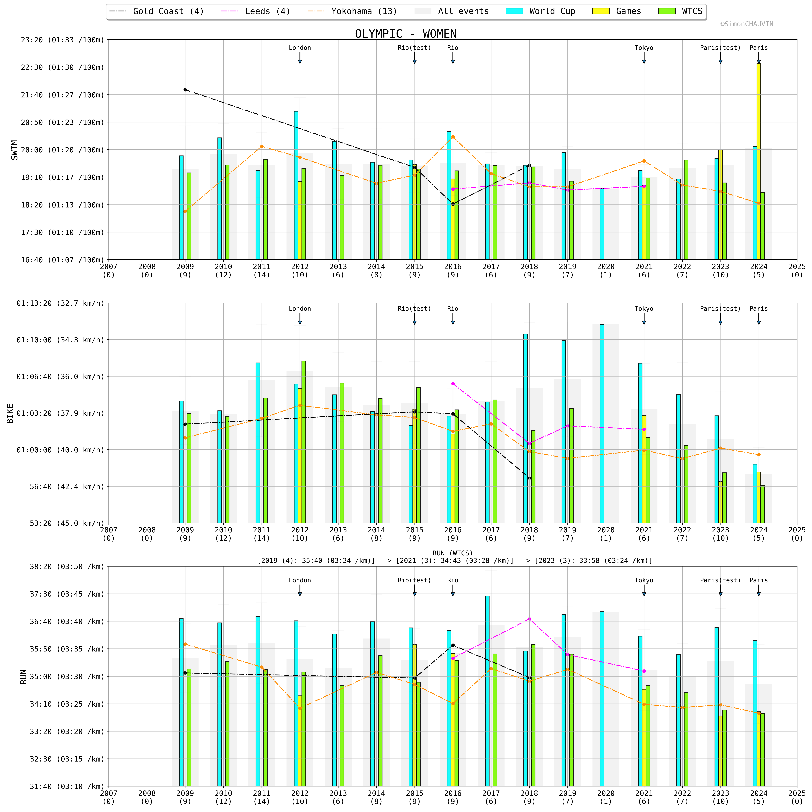 | 
|:---------------------------------------------------------------------:| 
|                       *Olympic format. Women.*                        |

| 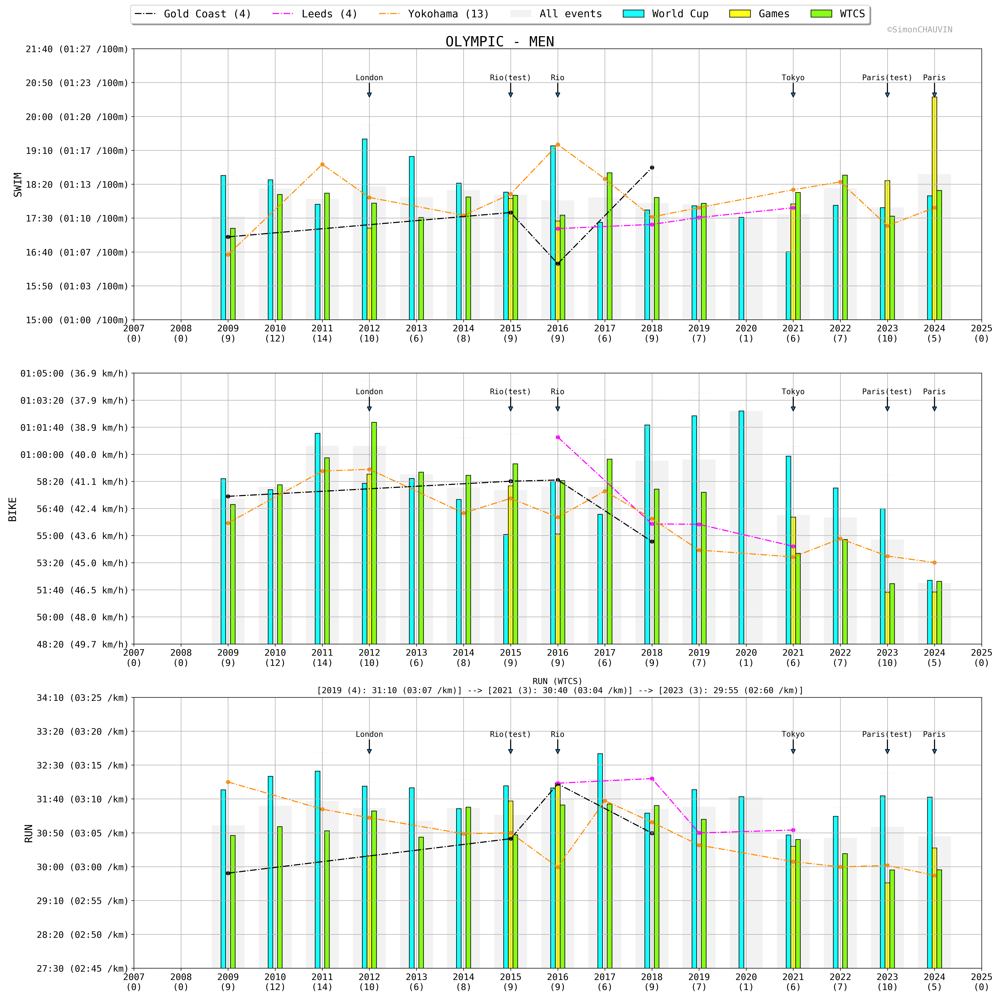 | 
|:---------------------------------------------------------------------:| 
|                        *Olympic format. Men.*                         |

---

<details>
  <summary>Click to expand - 🚀 <strong>Sprint format.</strong></summary>

| 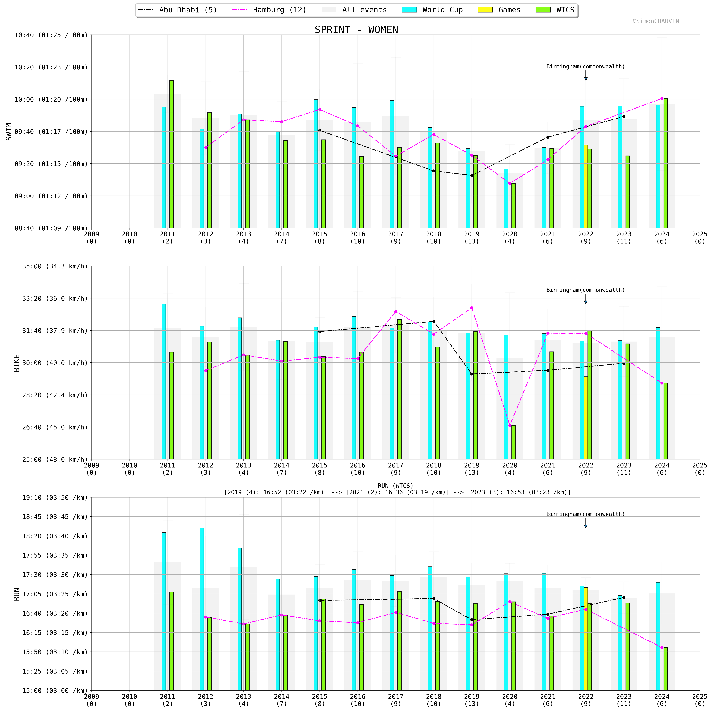 | 
|:-----------------------------------------------------------------:| 
|                      *Sprint format. Women.*                      |

| 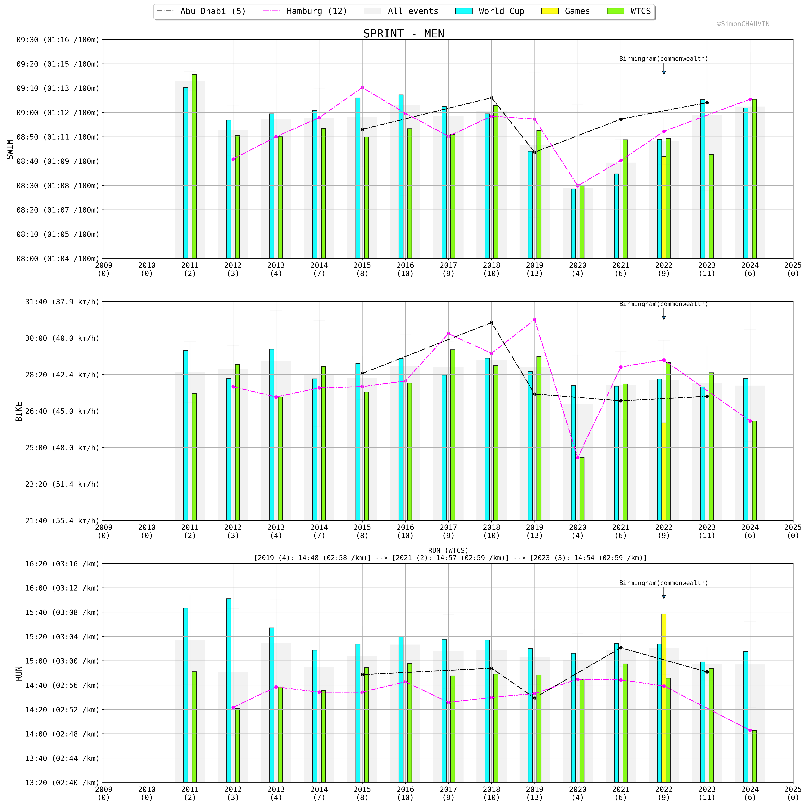 | 
|:-----------------------------------------------------------------:| 
|                       *Sprint format. Men.*                       |

</details>

---

In [this early-2024 video](https://youtu.be/iCpi2sUh6Ko?t=1838), **Vincent Luis** ( :fr: ) explains:

> "My running times are very similar to what I was doing in 2019-2020, when I was world champion. [...] It's just that **the level has gone up** [...]. I ran at **20km/h in Yokohama (2024)**. This is a pace that **5-6 years ago was enough to win some World Series**."

The above plots seem **consistent** with this statement. :chart_with_upwards_trend:
- The figures for women's and men's olympic-format show recent **improvements of the 10k run pace** (green bars) on **WTCS races**. For 2019 -> 2021 -> 2023, paces were:
  - `3:34 -> 3:28 -> 3:24` for women.
  - `3:07 -> 3:04 -> 3:00` for men.
- In 2023, `3:00 /km` was **hardly enough to finish between `5`-th and `9`-th on WTCS men's races**.
- The **`3:00 /km` pace mention by Luis was likely enough to win a WTCS in 2019**, since the `5`-th to `9`-th places were about `3:07`.

---

In [this other 2024 video](https://youtu.be/5dyR4zNMsmA?t=840):
- **Alex Yee** ( :gb: ) mentions that the **run of 2012 London ( :gb: ) Olympics** is a reference: "The run was held as the **best run that has ever been done in triathlon**".
- He explains: "In the last season _(2023)_, we had a few races which came very close to that".
- This statement seems to be correct: on the run subplot of the men's olympic format figure, **`London 2012` was the fastest until 2023**.
- This [article from triathlon.org](https://www.triathlon.org/news/article/a_chance_for_history_breaking_down_the_stats_of_past_olympic_games), released **just before Paris ( :fr: ) 2024**, confirms: "Brownlee’s times (London ( :gb: ) 2012) will likely come under threat. Indeed, it seems highly likely that we could see the **first ever sub-29** and **sub-33** minute 10km times in an Olympic triathlon this summer."
  - The 5-9th men **ran** at the 2024 Paris Olympics **much slower** that the year before for the **test event**.
  - Also Alex Yee ( :gb: ) won in 2024 with a **29:49** run, compared to **29:00 in 2023**. 
  - Because of the **heat** (the men's race started at **10am** instead of 8am)?
  - Or the fatigue caused by the very long swim?
  - Or was the **run course longer** in 2024? In this case the **women's run time improvement** would be even more **impressive**: Beth Potter ( :gb: ) did 32:57 in 2023, compared to **32:42** for Cassandre Beaugrand ( :fr: ) in 2024.

---

**Yokohama** :jp:
- The event took place **13 times** between 2009 and 2024 in an **olympic** format.
  - I do not know if the courses have changed.
  - But if not, the **comparison** should be **very relevant**.
- **Run times have decreased in the last five editions.** :athletic_shoe: 
  - Leading to the best ever times in 2024.
- It is interesting to note that runs were particularly **good on olympics years** (2012, 2016, 2021, 2024), especially for **women**.
  - Can it be that this race (usually happening early in the season) was used as **qualification criteria** or as a rehearsal and therefore attracting very fit and motivated athletes?

---

**Hamburg** :de:
- The event took place **12 times** between 2009 and 2024 in a **sprint** format.
- **Run times** have been constant until **2024**, where a **clear improvement** can be seen.
  - The 2024 race was used by many athletes as a **final repetition** before the Olympics.

---

Impact of **carbon plate running shoes**? :athletic_shoe:
- The Nike Vaporfly [came out in **2017**](https://en.wikipedia.org/wiki/Nike_Vaporfly_and_Tokyo_2020_Olympics_controversy#:~:text=The%20Nike%20Vaporfly%20first%20came,new%20series%20of%20running%20shoes).
- As for Yokohama ( :jp: ), the running paces have been **constantly improving on WTCS since 2017-2018**.
  - Running times were **already good before 2014**.
  - But **since 2021, paces have never been so low.**
- **Carbon plate technology could be one of the main factors** explaining this improvement.
  - But how to explain that running performances on **world-cups** have not followed the same trend?

---

The **bike(s)** :bike:
- On olympic format, bike times have been **drastically improving** (ignoring covid 2020 year) over the past 6 years, especially for the men.
- Can it be due to **tech innovations?**
- Maybe the level has gone up: **it is no longer just about being a good swimmer and an excellent runner?**

---

**World-cup vs WTCS** :trophy:
- Apart for 2018, the **running level** is consistently **higher in WTCS than in world-cups**.
- Which could be expected since **WTCS are so much selective**.

---

The swim of [2024 Paris ( :fr: ) Olympics](https://triathlon.org/results/result/paris_2024_olympic_games/655047) was very though because of the **current** on the way back:
- 20:29 (**01:22** /100m) for men.
- 22:36 (**01:30** /100m) for women.

---

**Criticisms** :warning:
- Not all events have **identical distances** and conditions.
  - However, **averaging many events** _(the number below the year on the x-axis)_ helps to **mitigate this variability**.
- Swim :swimmer:
  - Distances can vary based on **buoy positions**.
  - Differences in **water conditions** (e.g. rough sea, current) can significantly affect swim times, making comparisons challenging.
  - The **wetsuit** may be allowed or not.  
- Bike :bicyclist:
  - Weather conditions, particularly **wind** and **rain**, can influence bike times.
  - Variations in **course profiles (hilly vs. flat)** can make direct comparisons of bike times unfair.
- Run :running:
  - Run times are generally **more comparable** as ITU run courses tend to be **predominantly flat**, reducing variability.

---

---

# :earth_africa: HOST COUNTRIES

Countries having **hosted more than one** `world-series`, `world-cup` or `games-related` event since 2009:

|            COUNTRY             | COUNT |                                            VENUES                                             |
|:------------------------------:|:-----:|:---------------------------------------------------------------------------------------------:|
|          JPN ( :jp: )          |  21   |                     Yokohama (13), Miyazaki (6), Ishigaki (1), Tokyo (1)                      |
|      AUS ( :australia: )       |  18   |                  Mooloolaba (9), Gold Coast (5), Sydney (3), Wollongong (1)                   |
|          ESP ( :es: )          |  17   | Madrid (7), Valencia (3), Banyoles (2), Pontevedra (2), Palamos (1), Alicante (1), Huelva (1) |
|        MEX ( :mexico: )        |  16   |               Huatulco (8), Cozumel (4), Monterrey (2), Cancun (1), Mérida (1)                |
|          KOR ( :kr: )          |  14   |              Tongyeong (9), Tongyeong  (2), Seoul (1), Haeundae (1), Yeongdo (1)              |
|          GER ( :de: )          |  14   |                                         Hamburg (14)                                          |
|          GBR ( :gb: )          |  14   |                     London (7), Leeds (5), Birmingham (1), Sunderland (1)                     |
|        CAN ( :canada: )        |  13   |                                  Edmonton (9), Montreal (4)                                   |
|     NZL ( :new_zealand: )      |  11   |                          New Plymouth (6), Auckland (4), Napier (1)                           |
|          ITA ( :it: )          |  11   |                             Cagliari (7), Arzachena (3), Rome (1)                             |
|       HUN ( :hungary: )        |  10   |                                       Tiszaujvaros (9)                                        |
|          CHN ( :cn: )          |  10   |                Chengdu (5), Weihai (2), Beijing (1), Jiayuguan (1), Weihai (1)                |
| UAE ( :united_arab_emirates: ) |   8   |                                         Abu Dhabi (8)                                         |
|    CZE ( :czech_republic: )    |   6   |                                       Karlovy Vary (6)                                        |
|          USA ( :us: )          |   6   |                          Des Moines (2), San Diego (2), Chicago (2)                           |
|        SWE ( :sweden: )        |   5   |                                         Stockholm (5)                                         |
|       AUT ( :austria: )        |   4   |                                         Kitzbuhel (4)                                         |
|     RSA ( :south_africa: )     |   4   |                                         Cape Town (4)                                         |
|       BER ( :bermuda: )        |   3   |                                          Bermuda (3)                                          |
|        BRA ( :brazil: )        |   3   |                                      Rio de Janeiro (2)                                       |
|       ECU ( :ecuador: )        |   3   |                                          Salinas (3)                                          |
|     SUI ( :switzerland: )      |   3   |                                         Lausanne (3)                                          |
|        CHI ( :chile: )         |   2   |                                       Vina del Mar (2)                                        |
|          TUR ( :tr: )          |   2   |                                          Alanya (2)                                           |

It can be that some events are missing: these entries come from the data used for this report, after filtering and cleaning. 

<details>
  <summary>Click to expand - <strong>Top host countries for world-series.</strong></summary>

|            COUNTRY             | COUNT |                VENUES                 |
|:------------------------------:|:-----:|:-------------------------------------:|
|          GER ( :de: )          |  14   |             Hamburg (14)              |
|          JPN ( :jp: )          |  13   |             Yokohama (13)             |
|          GBR ( :gb: )          |  12   | London (6), Leeds (5), Sunderland (1) |
|        CAN ( :canada: )        |  10   |      Edmonton (7), Montreal (3)       |
|      AUS ( :australia: )       |   8   |      Gold Coast (5), Sydney (3)       |
| UAE ( :united_arab_emirates: ) |   8   |             Abu Dhabi (8)             |
|          ESP ( :es: )          |   6   |      Madrid (5), Pontevedra (1)       |
|        SWE ( :sweden: )        |   5   |             Stockholm (5)             |
|          USA ( :us: )          |   4   |      San Diego (2), Chicago (2)       |
|       AUT ( :austria: )        |   4   |             Kitzbuhel (4)             |

</details>

<details>
  <summary>Click to expand - <strong>Top host countries for world-cups.</strong></summary>

|         COUNTRY          | COUNT |                                            VENUES                                             |
|:------------------------:|:-----:|:---------------------------------------------------------------------------------------------:|
|     MEX ( :mexico: )     |  15   |               Huatulco (8), Cozumel (3), Monterrey (2), Cancun (1), Mérida (1)                |
|       KOR ( :kr: )       |  12   |                   Tongyeong (8), Tongyeong  (2), Haeundae (1), Yeongdo (1)                    |
|       ESP ( :es: )       |  11   | Valencia (3), Banyoles (2), Madrid (2), Palamos (1), Alicante (1), Huelva (1), Pontevedra (1) |
|   AUS ( :australia: )    |  10   |                                Mooloolaba (9), Wollongong (1)                                 |
|       CHN ( :cn: )       |   9   |             Jintang (3), Weihai (2), Chengdu (2), Gansu (1), Weihai, Shandong (1)             |
|    HUN ( :hungary: )     |   9   |                              Tiszaujvaros (7), Tiszaujvaros  (2)                              |
|       ITA ( :it: )       |   8   |                       Cagliari (4), Cannigione, Arzachena (3), Rome (1)                       |
|  NZL ( :new_zealand: )   |   8   |                          New Plymouth (6), Auckland (1), Napier (1)                           |
|       JPN ( :jp: )       |   7   |                                  Miyazaki (6), Ishigaki (1)                                   |
| CZE ( :czech_republic: ) |   6   |                                       Karlovy Vary (6)                                        |

</details>

---

---

# :calendar: SEASON DURATION

This section **examines the duration of the competition season** and the **number of races** athletes participate in.

|                                           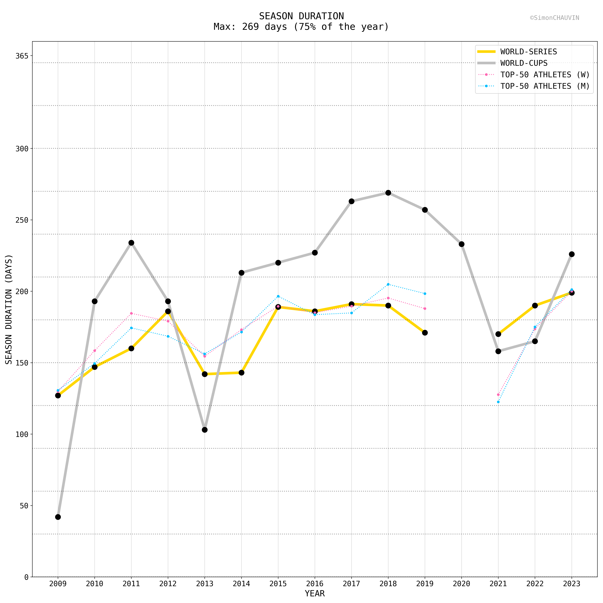                                            | 
|:------------------------------------------------------------------------------------------------------------------------------------:| 
| *Duration of World Cup and World Series seasons, as well as the duration of the seasons of the top 50 athletes in the WTCS ranking.* |


### World-Series

2020, 2021 and to some extent 2022 have been affected by the covid pandemic. Their rows are written in _italic_.

|  Year  |  Num. events  |               Season duration               |    Start    |     End     |                                                             First event                                                              |                                                                    Last event                                                                    |
|:------:|:-------------:|:-------------------------------------------:|:-----------:|:-----------:|:------------------------------------------------------------------------------------------------------------------------------------:|:------------------------------------------------------------------------------------------------------------------------------------------------:|
|  2009  |       7       |             127 days (~ 4.2 m)              |  **05**-02  |  **09**-09  | [Tongyeong ( :kr: )](https://www.triathlon.org/events/event/2009_dextro_energy_triathlon_-_itu_world_championship_series_tongyeong)  | [Gold Coast ( :australia: )](https://www.triathlon.org/events/event/2009_dextro_energy_triathlon_-_itu_world_championship_grand_final_gold_coas) |
|  2010  |       7       |             147 days (~ 4.9 m)              |  **04**-11  |  **09**-08  | [Sydney ( :australia: )](https://www.triathlon.org/events/event/2010_dextro_energy_triathlon_-_itu_world_championship_series_sydney) |   [Budapest ( :hungary: )](https://www.triathlon.org/events/event/2010_dextro_energy_triathlon_-_itu_triathlon_world_championship_grand_final)   |
|  2011  |       8       |             160 days (~ 5.3 m)              |  **04**-09  |  **09**-19  | [Sydney ( :australia: )](https://www.triathlon.org/events/event/2011_dextro_energy_triathlon_-_itu_world_championship_series_sydney) |        [Yokohama ( :jp: )](https://www.triathlon.org/events/event/2011_dextro_energy_triathlon_-_itu_world_championship_series_yokohama)         |
|  2012  |       8       |             186 days (~ 6.2 m)              |  **04**-14  |  **10**-20  |                   [Sydney ( :australia: )](https://www.triathlon.org/events/event/2012_itu_world_triathlon_sydney)                   |                [Auckland ( :new_zealand: )](https://www.triathlon.org/events/event/2012_itu_world_triathlon_grand_final_auckland)                |
|  2013  |       7       |             155 days (~ 5.2 m)              |  **04**-06  |  **09**-11  |                [Auckland ( :new_zealand: )](https://www.triathlon.org/events/event/2013_itu_world_triathlon_auckland)                |                      [London ( :gb: )](https://www.triathlon.org/events/event/2013_itu_world_triathlon_grand_final_london)                       |
|  2014  |       7       |             143 days (~ 4.8 m)              |  **04**-06  |  **08**-29  |                [Auckland ( :new_zealand: )](https://www.triathlon.org/events/event/2014_itu_world_triathlon_auckland)                |                  [Edmonton ( :canada: )](https://www.triathlon.org/events/event/2014_itu_world_triathlon_grand_final_edmonton)                   |
|  2015  |       9       |             189 days (~ 6.3 m)              |  **03**-06  |  **09**-15  |          [Abu Dhabi ( :united_arab_emirates: )](https://www.triathlon.org/events/event/2015_itu_world_triathlon_abu_dhabi)           |                     [Chicago ( :us: )](https://www.triathlon.org/events/event/2015_itu_world_triathlon_grand_final_chicago)                      |
|  2016  |       9       |             186 days (~ 6.2 m)              |  **03**-05  |  **09**-11  |          [Abu Dhabi ( :united_arab_emirates: )](https://www.triathlon.org/events/event/2016_itu_world_triathlon_abu_dhabi)           |                   [Cozumel ( :mexico: )](https://www.triathlon.org/events/event/2016_itu_world_triathlon_grand_final_cozumel)                    |
|  2017  |       9       |             191 days (~ 6.4 m)              |  **03**-03  |  **09**-14  |          [Abu Dhabi ( :united_arab_emirates: )](https://www.triathlon.org/events/event/2017_itu_world_triathlon_abu_dhabi)           |               [Rotterdam ( :netherlands: )](https://www.triathlon.org/events/event/2017_itu_world_triathlon_grand_final_rotterdam)               |
|  2018  |       8       |             190 days (~ 6.3 m)              |  **03**-02  |  **09**-12  |          [Abu Dhabi ( :united_arab_emirates: )](https://www.triathlon.org/events/event/2018_itu_world_triathlon_abu_dhabi)           |               [Gold Coast ( :australia: )](https://www.triathlon.org/events/event/2018_itu_world_triathlon_grand_final_gold_coast)               |
|  2019  |       8       |             171 days (~ 5.7 m)              |  **03**-08  |  **08**-29  |          [Abu Dhabi ( :united_arab_emirates: )](https://www.triathlon.org/events/event/2019_itu_world_triathlon_abu_dhabi)           |                [Lausanne ( :switzerland: )](https://www.triathlon.org/events/event/2019_itu_world_triathlon_grand_final_lausanne)                |
| _2020_ |      _1_      | _0 days_ ( :mask: :face_with_thermometer: ) | _**09**-05_ | _**09**-05_ |                    _[Hamburg ( :de: )](https://www.triathlon.org/events/event/2020_itu_world_triathlon_hamburg)_                     |                          _[Hamburg ( :de: )](https://www.triathlon.org/events/event/2020_itu_world_triathlon_hamburg)_                           |
| _2021_ |      _5_      |            _170 days (~ 5.7 m)_             | _**05**-15_ | _**11**-05_ |                     _[Yokohama ( :jp: )](https://www.triathlon.org/events/event/2021_world_triathlon_yokohama)_                      |       _[Abu Dhabi ( :united_arab_emirates: )](https://www.triathlon.org/events/event/2021_world_triathlon_championship_series_abu_dhabi)_        |
| _2022_ |      _6_      |            _190 days (~ 6.3 m)_             | _**05**-14_ | _**11**-24_ |           _[Yokohama ( :jp: )](https://www.triathlon.org/events/event/2022_world_triathlon_championship_series_yokohama)_            |       _[Abu Dhabi ( :united_arab_emirates: )](https://www.triathlon.org/events/event/2022_world_triathlon_championship_finals_abu_dhabi)_        |
|  2023  |       6       |             199 days (~ 6.6 m)              |  **03**-03  |  **09**-22  |  [Abu Dhabi ( :united_arab_emirates: )](https://www.triathlon.org/events/event/2023_world_triathlon_championship_series_abu_dhabi)   |                [Pontevedra ( :es: )](https://www.triathlon.org/events/event/2023_world_triathlon_championship_finals_pontevedra)                 |
|  2024  |       2       |              14 days (~ 0.5 m)              |  **05**-11  |  **05**-25  |            [Yokohama ( :jp: )](https://www.triathlon.org/events/event/2023_world_triathlon_championship_series_yokohama1)            |                  [Cagliari ( :it: )](https://www.triathlon.org/events/event/2024_world_triathlon_championship_series_cagliari)                   |


### World-Cups


|  Year  |  Num. events  |   Season duration    |    Start    |     End     |                                                  First event                                                   |                                                 Last event                                                 |
|:------:|:-------------:|:--------------------:|:-----------:|:-----------:|:--------------------------------------------------------------------------------------------------------------:|:----------------------------------------------------------------------------------------------------------:|
|  2009  |       3       |  131 days (~ 4.4 m)  |  **06**-27  |  **11**-08  |       [Des Moines ( :us: )](https://www.triathlon.org/events/event/2009_hy-vee_itu_triathlon_elite_cup)        |   [Huatulco ( :mexico: )](https://www.triathlon.org/events/event/2009_huatulco_itu_triathlon_world_cup)    |
|  2010  |       5       |  193 days (~ 6.4 m)  |  **03**-27  |  **10**-10  |  [Mooloolaba ( :australia: )](https://www.triathlon.org/events/event/2010_mooloolaba_itu_triathlon_world_cup)  |   [Huatulco ( :mexico: )](https://www.triathlon.org/events/event/2010_huatulco_itu_triathlon_world_cup)    |
|  2011  |       8       |  234 days (~ 7.8 m)  |  **03**-26  |  **11**-20  |  [Mooloolaba ( :australia: )](https://www.triathlon.org/events/event/2011_mooloolaba_itu_triathlon_world_cup)  | [Auckland ( :new_zealand: )](https://www.triathlon.org/events/event/2011_auckland_itu_triathlon_world_cup) |
|  2012  |       7       |  193 days (~ 6.4 m)  |  **03**-24  |  **10**-07  |  [Mooloolaba ( :australia: )](https://www.triathlon.org/events/event/2012_mooloolaba_itu_triathlon_world_cup)  |     [Cancun ( :mexico: )](https://www.triathlon.org/events/event/2012_cancun_itu_triathlon_world_cup)      |
|  2013  |      10       |  221 days (~ 7.4 m)  |  **03**-16  |  **10**-27  |  [Mooloolaba ( :australia: )](https://www.triathlon.org/events/event/2013_mooloolaba_itu_triathlon_world_cup)  |   [Guatape ( :colombia: )](https://www.triathlon.org/events/event/2013_guatape_itu_triathlon_world_cup)    |
|  2014  |       9       |  213 days (~ 7.1 m)  |  **03**-15  |  **10**-18  |  [Mooloolaba ( :australia: )](https://www.triathlon.org/events/event/2014_mooloolaba_itu_triathlon_world_cup)  |    [Tongyeong ( :kr: )](https://www.triathlon.org/events/event/2014_tongyeong_itu_triathlon_world_cup)     |
|  2015  |       7       |  220 days (~ 7.3 m)  |  **03**-14  |  **10**-24  |  [Mooloolaba ( :australia: )](https://www.triathlon.org/events/event/2015_mooloolaba_itu_triathlon_world_cup)  |    [Tongyeong ( :kr: )](https://www.triathlon.org/events/event/2015_tongyeong_itu_triathlon_world_cup)     |
|  2016  |      10       |  227 days (~ 7.6 m)  |  **03**-12  |  **10**-29  |  [Mooloolaba ( :australia: )](https://www.triathlon.org/events/event/2016_mooloolaba_itu_triathlon_world_cup)  |     [Miyazaki ( :jp: )](https://www.triathlon.org/events/event/2016_miyazaki_itu_triathlon_world_cup)      |
|  2017  |      12       |  263 days (~ 8.8 m)  |  **02**-11  |  **11**-04  | [Cape Town ( :south_africa: )](https://www.triathlon.org/events/event/2017_cape_town_itu_triathlon_world_cup)  |     [Miyazaki ( :jp: )](https://www.triathlon.org/events/event/2016_miyazaki_itu_triathlon_world_cup1)     |
|  2018  |      11       |  269 days (~ 9.0 m)  |  **02**-11  |  **11**-10  | [Cape Town ( :south_africa: )](https://www.triathlon.org/events/event/2018_cape_town_itu_triathlon_world_cup)  |     [Miyazaki ( :jp: )](https://www.triathlon.org/events/event/2018_miyazaki_itu_triathlon_world_cup)      |
|  2019  |      13       |  257 days (~ 8.6 m)  |  **02**-09  |  **10**-26  | [Cape Town ( :south_africa: )](https://www.triathlon.org/events/event/2019_cape_town_itu_triathlon_world_cup)  |     [Miyazaki ( :jp: )](https://www.triathlon.org/events/event/2019_miyazaki_itu_triathlon_world_cup)      |
| _2020_ |      _4_      | _233 days (~ 7.8 m)_ | _**03**-14_ | _**11**-07_ | _[Mooloolaba ( :australia: )](https://www.triathlon.org/events/event/2020_mooloolaba_itu_triathlon_world_cup)_ |    _[Valencia ( :es: )](https://www.triathlon.org/events/event/2020_valencia_itu_triathlon_world_cup)_     |
| _2021_ |      _6_      | _158 days (~ 5.3 m)_ | _**05**-22_ | _**10**-30_ |       _[Lisbon ( :portugal: )](https://www.triathlon.org/events/event/2021_world_triathlon_cup_lisbon)_        |     _[Tongyeong  ( :kr: )](https://www.triathlon.org/events/event/2021_world_triathlon_cup_tongyeong)_     |
| _2022_ |      _9_      | _165 days (~ 5.5 m)_ | _**05**-28_ | _**11**-13_ |       _[Arzachena ( :it: )](https://www.triathlon.org/events/event/2022_world_triathlon_cup_arzachena)_        | _[Vina del Mar ( :chile: )](https://www.triathlon.org/events/event/2022_world_triathlon_cup_vina_del_mar)_ |
|  2023  |      14       |  226 days (~ 7.5 m)  |  **03**-25  |  **11**-11  | [New Plymouth ( :new_zealand: )](https://www.triathlon.org/events/event/2023_world_triathlon_cup_new_plymouth) |  [Vina del Mar ( :chile: )](https://www.triathlon.org/events/event/2023_world_triathlon_cup_vina_del_mar)  |
|  2024  |       6       |  84 days (~ 2.8 m)   |  **02**-24  |  **05**-18  |       [Napier ( :new_zealand: )](https://www.triathlon.org/events/event/2024_world_triathlon_cup_napier)       |  [Samarkand ( :uzbekistan: )](https://www.triathlon.org/events/event/2024_world_triathlon_cup_samarkand)   |


## Athlete seasons

The following plots represent the **seasons** (columns) of **50 athletes** (rows).
- The top-50 of **[`World Triathlon Championship Series Rankings`](https://triathlon.org/rankings/world_triathlon_championship_series/male)** is used.
- The [`World Triathlon Rankings`](https://triathlon.org/rankings/world_triathlon_rankings/male) would have been preferred since it takes both **world-cups** and **world-series** into consideration.
  - Unfortunately, I could not find any archive for 2018, 2020, 2021, 2023. :disappointed:

| 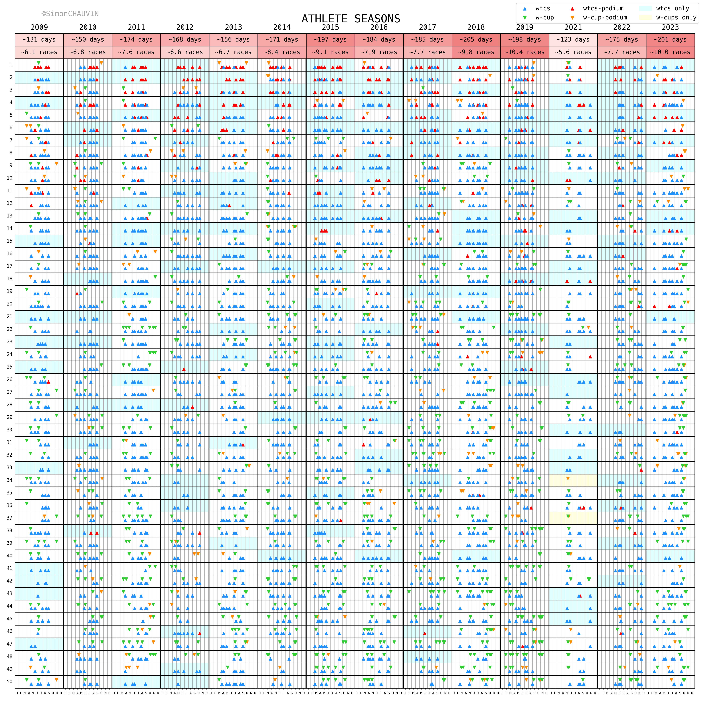 | 
|:-------------------------------------------------------------------:| 
|               *Seasons of the top-50 athletes. Men.*                |

| 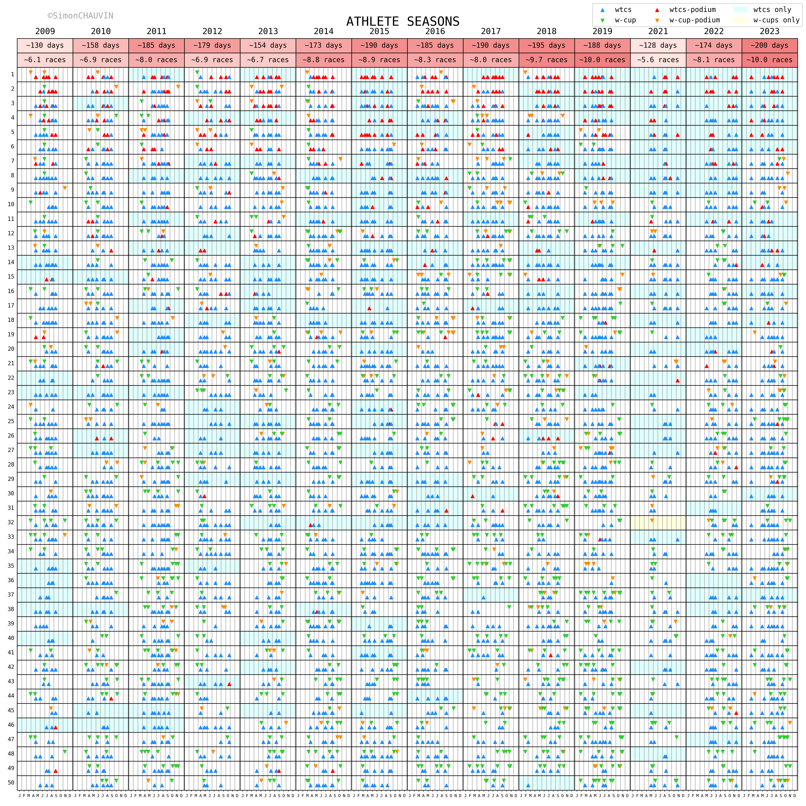 | 
|:-------------------------------------------------------------------:| 
|              *Seasons of the top-50 athletes. Women.*               |

**Top athletes** seem to **prefer world series over world cups** (more red than blue in the top rows).
- Probably because WTCS events offer **more points** and **prize money**.
- Some athletes do not race in any world cup events (light blue background).

Regarding the **competition season**: from 2009 to 2019, it **became longer**.
- The 2009 WTCS season started in May, but from 2015-2019, it began in early March.
- In 2023, the WTCS season was **6.5 months long**, compared to **4.2 months in 2009**.
- The number of world cup events increased significantly during this period: from **3 in 2009 to 13 in 2019**.
  - The **2018 world cup** season lasted **9 months**.
- The **COVID-19 pandemic halted this trend**, although 2023 seems similar to 2019.
  - The ranking process became complicated: e.g., some 2021 races were considered for the 2022 ranking.

Regarding the **athletes' season**: it **follows** the competition season.
- Their ITU season extended **from 130 days in 2009** to **200 days in 2023**.
- On average, athletes raced **10 times in 2019** and **2023**, compared to **6 times in 2009**.

The results found (**number of races** and **season duration**) are **lower bounds**:
- Athletes participate in **other formats besides ITU olympic and sprint** races.
  - For instance, the [French Grand Prix](https://en.wikipedia.org/wiki/Grand_Prix_de_Triathlon) was very popular in the 2010s.
  - Some athletes are racing the **Ironman 70.3** format as well.
- Their competition season is probably longer, including **indoor races** in the **winter**.

---

---

# :earth_africa: ATHLETE NATIONS

This table examines the **nationalities** of **athletes in the top-50s** of the [`WTCS Ranking`](https://triathlon.org/rankings/world_triathlon_championship_series/male) from 2009 to 2023:

|  RANGE (%)  |                                                                                  NATIONS (W)                                                                                  |                                                                                                                                                       NATIONS (M)                                                                                                                                                       |
|:-----------:|:-----------------------------------------------------------------------------------------------------------------------------------------------------------------------------:|:-----------------------------------------------------------------------------------------------------------------------------------------------------------------------------------------------------------------------------------------------------------------------------------------------------------------------:|
|    11-12    |                                                                                 :us:  (11.0%)                                                                                 |                                                                                                                                                                                                                                                                                                                         |
|    10-11    |                                                                      :gb:  (10.9%)  :australia:  (10.1%)                                                                      |                                                                                                                                                                                                                                                                                                                         |
|    9-10     |                                                                                                                                                                               |                                                                                                                                                      :fr:  (9.6%)                                                                                                                                                       |
|     8-9     |                                                                                 :jp:  (8.0%)                                                                                  |                                                                                                                                               :gb:  (8.4%)  :de:  (8.1%)                                                                                                                                                |
|     7-8     |                                                                                 :de:  (7.6%)                                                                                  |                                                                                                                                            :australia:  (7.7%)  :es:  (7.0%)                                                                                                                                            |
|     6-7     |                                                                                                                                                                               |                                                                                                                                                      :us:  (6.1%)                                                                                                                                                       |
|     5-6     |                                                                      :new_zealand:  (5.7%)  :fr:  (5.0%)                                                                      |                                                                                                                                                                                                                                                                                                                         |
|     4-5     |                                                                                                                                                                               |                                                                                                                   :new_zealand:  (4.6%)  :switzerland:  (4.6%)  :canada:  (4.4%)  :portugal:  (4.3%)                                                                                                                    |
|     3-4     |                                          :canada:  (3.7%)  :es:  (3.7%)  :it:  (3.7%)  :netherlands:  (3.6%)  :switzerland:  (3.3%)                                           |                                                                                                                                          :ru:  (3.6%)  :south_africa:  (3.4%)                                                                                                                                           |
|     2-3     |                                                             :austria:  (2.6%)  :mexico:  (2.1%)  :brazil:  (2.0%)                                                             |                                                                                                          :jp:  (2.9%)  :belgium:  (2.9%)  :hungary:  (2.6%)  :it:  (2.4%)  :norway:  (2.4%)  :mexico:  (2.3%)                                                                                                           |
|     1-2     | :belgium:  (1.9%)  :czech_republic:  (1.7%)  :south_africa:  (1.7%)  :ru:  (1.6%)  :poland:  (1.3%)  :hungary:  (1.3%)  :bermuda:  (1.3%)  :chile:  (1.1%)  :ireland:  (1.0%) |                                                                                                   :brazil:  (1.7%)  :white_flag:  (1.4%)  :austria:  (1.1%)  :slovakia:  (1.1%)  :ireland:  (1.0%)  :israel:  (1.0%)                                                                                                    |
|     0-1     |           :portugal:  (0.9%)  :sweden:  (0.7%)  :denmark:  (0.7%)  :luxembourg:  (0.4%)  :ukraine:  (0.4%)  :slovenia:  (0.4%)  :norway:  (0.4%)  :estonia:  (0.1%)           | :kazakhstan:  (0.7%)  :azerbaijan:  (0.7%)  :denmark:  (0.7%)  :czech_republic:  (0.6%)  :ukraine:  (0.3%)  :costa_rica:  (0.3%)  :puerto_rico:  (0.3%)  :barbados:  (0.3%)  :netherlands:  (0.3%)  :argentina:  (0.3%)  :luxembourg:  (0.3%)  :poland:  (0.1%)  :colombia:  (0.1%)  :morocco:  (0.1%)  :chile:  (0.1%) |

### :ticket: Olympics qualification

The **Olympics competition** has **55 spots**, with a limit of **3 athletes per nations**.

Considering nations with a high percentage of athletes in top-50, let's estimate **how many athletes miss the Olympics** because of **the _'max-3-rule'_**:
- **Women:**
  - :us: : ~11.0% => **~3.0** top-50 athletes rejected. :disappointed:
  - :gb: : ~10.9% => **~3.0** top-50 athletes rejected. :disappointed:
  - :australia: : ~10.1% => **~2.6** top-50 athletes rejected. :disappointed:
  - :jp: : ~8.0% => **~1.4** top-50 athletes rejected. :disappointed:
  - :de: : ~7.6% => **~1.2** top-50 athletes rejected. :disappointed:
  - :new_zealand: : ~5.7% => ~0.1 top-50 athlete rejected. :disappointed:
- **Men:**
  - :fr: : ~9.6% => **~2.3** top-50 athletes rejected. :disappointed:
  - :gb: : ~8.4% => **~1.6** top-50 athletes rejected. :disappointed:
  - :de: : ~8.1% => **~1.5** top-50 athletes rejected. :disappointed:
  - :australia: : ~7.7% => **~1.2** top-50 athletes rejected. :disappointed:
  - :es: : ~7.0% => ~0.9 top-50 athlete rejected. :disappointed:
  - :us: : ~6.1% => ~0.4 top-50 athlete rejected. :disappointed:

The estimated **numbers of rejections** are probably **lower bounds**:
- The ITU **limits the number of athletes per nation** for its races too.
  - As a result, some strong athletes, such as US women, cannot participate in important ITU races, and thus do not gain points for the ranking.

The percentages are **averages** since 2009. Some years, they can be **much higher**:
- For instance, **8 women in the top-50** (**16.0%**) for:
  - :us: [2015](https://triathlon.org/rankings/itu_world_triathlon_series_2015/female) (a pre-olympics year), with **6 top-30** and the **4th athlete was ranked 16th**.
  - :us: [2016](https://triathlon.org/rankings/itu_world_triathlon_series_2016/female), with **6 top-20**.
  - :australia: [2017](https://triathlon.org/rankings/itu_world_triathlon_series_2017/female).
  - :gb: [2021](https://triathlon.org/rankings/world_triathlon_championship_series_2021/female), with **8 top-30**.
    - The same year, :us: had **5 athletes in the top-12**.

It is no wonder that some athletes **change nationality** to try to qualify for the Olympics.

---

---

# :baby: AGE

|          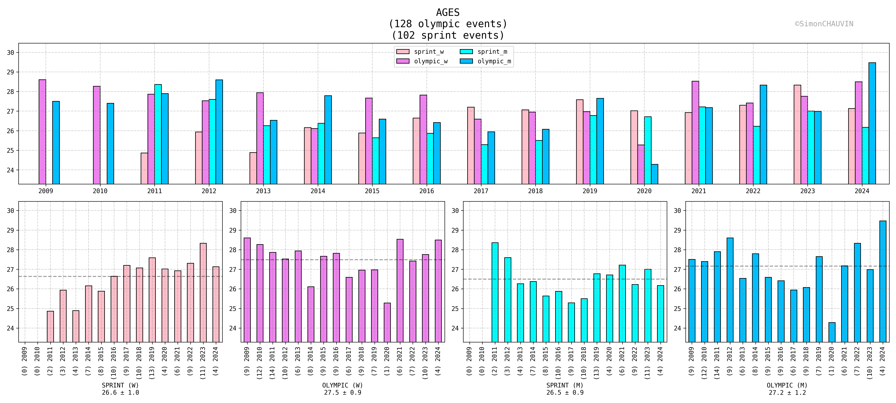           | 
|:--------------------------------------------:| 
| *Age of athletes ranked 5th-9th over years.* |

Athletes finishing 5th-9th are, on average, **26.5 to 27.5** years old.
- Ages are **similar** for **women and men**.
- Athletes are **slightly older** in the **olympic format**, with **less than a one-year difference** compared to the sprint format.
  - _I would have expected a larger difference._
- There are some small variations, but **no significant trends over the years**.

---

---

# :checkered_flag: AGE OF LAST RACE

|  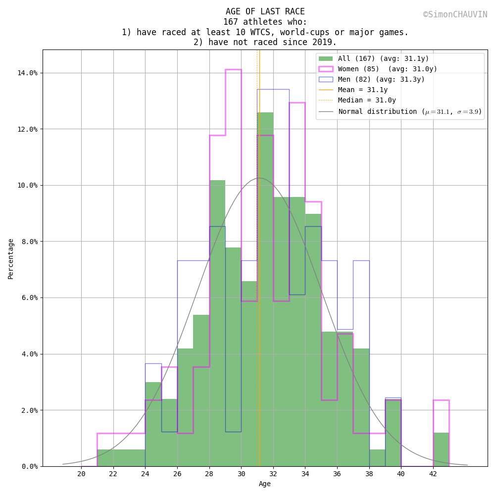  | 
|:-----------------------------------------------------:| 
| *Age of last world-cup, world-series or major games.* |

The **average age** of the last race is **similar for women and men**: around **31 years**.

The **distribution is broad** (`~4y std`), because there are **various reasons** for ending an ITU short-distance top career, such as:
- **Age limit** for elite sport.
- Transitioning to **longer-distance** triathlons
- **Injury**.
- **Personal reasons**, such as pregnancy or changing careers.

Some **extreme values**:
- **`<25` years**:
  - Hollie Avil ( :gb: ): **21y**, 13 races.
  - Kirsten Nuyes ( :netherlands: ): **22y**, 21 races.
  - Ellen Pennock ( :canada: ): **23y**, 17 races.
  - Hanna Philippin ( :de: ): **24y**, 32 races.
  - Marc Austin ( :gb: ): **24y**, 25 races.
  - Sophia Saller ( :de: ): **24y**, 26 races.
  - Oliver Freeman ( :gb: ): **24y**, 20 races.
  - Raphael Montoya ( :fr: ): **24y**, 21 races.
- **`>38` years**:
  - Magali Di Marco Messmer ( :switzerland: ): **39y**, 52 races.
  - Greg Bennett ( :australia: ): **39y**, 70 races.
  - Hunter Kemper ( :us: ): **39y**, 65 races.
  - Kate Allen ( :austria: ): **39y**, 24 races.
  - Samantha Warriner ( :new_zealand: ): **42y**, 48 races.
  - Kiyomi Niwata ( :jp: ): **43y**, 96 races.

<details>
  <summary>Click to expand - 📜 <strong>Full list.</strong></summary>

|         ATHLETE          |     COUNTRY      |  AGE OF LAST RACE  |  NUMBER OF RACES  |
|:------------------------:|:----------------:|:------------------:|:-----------------:|
|       Hollie Avil        |       :gb:       |         21         |        13         |
|      Kirsten Nuyes       |  :netherlands:   |         22         |        21         |
|      Ellen Pennock       |     :canada:     |         23         |        17         |
|     Hanna Philippin      |       :de:       |         24         |        32         |
|       Marc Austin        |       :gb:       |         24         |        25         |
|      Sophia Saller       |       :de:       |         24         |        26         |
|      Oliver Freeman      |       :gb:       |         24         |        20         |
|     Raphael Montoya      |       :fr:       |         24         |        21         |
|    Akane Tsuchihashi     |       :jp:       |         25         |        27         |
|     Sarissa De Vries     |  :netherlands:   |         25         |        26         |
|        Ron Darmon        |     :israel:     |         25         |        44         |
|       Daniela Ryf        |  :switzerland:   |         25         |        42         |
|      Artem Parienko      |       :ru:       |         26         |        23         |
|    Jose Miguel Perez     |       :es:       |         26         |        30         |
|       James Seear        |   :australia:    |         26         |        29         |
|     Gareth Halverson     |   :australia:    |         26         |        17         |
|     Lucy Buckingham      |       :gb:       |         26         |        44         |
|      David McNamee       |       :gb:       |         26         |        34         |
|      Wian Sullwald       |  :south_africa:  |         26         |        70         |
|      Natalie Milne       |       :gb:       |         27         |        14         |
|       Aaron Harris       |       :gb:       |         27         |        27         |
|      Franz Löschke       |       :de:       |         27         |        36         |
|    Andrey Bryukhankov    |       :ru:       |         27         |        36         |
|      Paul Tichelaar      |     :canada:     |         27         |        33         |
|      Felicity Abram      |   :australia:    |         27         |        46         |
|      Mariya Shorets      |       :ru:       |         27         |        47         |
|      Sebastian Rank      |       :de:       |         27         |        28         |
|      Matthew Sharp       |       :gb:       |         27         |        22         |
|       Jenna Parker       |       :us:       |         28         |        21         |
|      Denis Vasiliev      |       :ru:       |         28         |        29         |
|      Benjamin Shaw       |    :ireland:     |         28         |        50         |
|    Sarah-Anne Brault     |     :canada:     |         28         |        32         |
|     Agnieszka Jerzyk     |     :poland:     |         28         |        52         |
|       Andrew Yorke       |     :canada:     |         28         |        42         |
|      Maaike Caelers      |  :netherlands:   |         28         |        56         |
|   Tamara Gomez Garrido   |       :es:       |         28         |        32         |
|       Ivan Tutukin       |   :kazakhstan:   |         28         |        34         |
|     Rebecca Robisch      |       :de:       |         28         |        46         |
|      Kathrin Muller      |       :de:       |         28         |        39         |
|    Kirsten Sweetland     |     :canada:     |         28         |        49         |
|      Paula Findlay       |     :canada:     |         28         |        41         |
|       Peter Croes        |    :belgium:     |         28         |        58         |
|      Kaitlin Donner      |       :us:       |         28         |        37         |
|       Jason Wilson       |    :barbados:    |         28         |        45         |
|      William Clarke      |       :gb:       |         28         |        44         |
|      Jodie Swallow       |       :gb:       |         29         |        32         |
|       Vanessa Raw        |       :gb:       |         29         |        25         |
|     Emmie Charayron      |       :fr:       |         29         |        43         |
|      Katie Hewison       |       :gb:       |         29         |        16         |
|     Jillian Elliott      |       :us:       |         29         |        31         |
|     Andreas Giglmayr     |    :austria:     |         29         |        51         |
|     Radka Kahlefeldt     | :czech_republic: |         29         |        31         |
|    Danne Boterenbrood    |  :netherlands:   |         29         |        20         |
|     Charlotte Bonin      |       :it:       |         29         |        62         |
|      Svenja Bazlen       |       :de:       |         29         |        28         |
|      Elizabeth May       |   :luxembourg:   |         29         |        55         |
|     Annabel Luxford      |   :australia:    |         29         |        52         |
|   Anastasia Abrosimova   |       :ru:       |         29         |        44         |
|       Cameron Good       |   :australia:    |         30         |        33         |
|        Mari Rabie        |  :south_africa:  |         30         |        50         |
|      Brendan Sexton      |   :australia:    |         30         |        57         |
|      Kathy Tremblay      |     :canada:     |         30         |        54         |
|      Jodie Stimpson      |       :gb:       |         30         |        71         |
|      Laurent Vidal       |       :fr:       |         30         |        61         |
|     Yulian Malyshev      |       :ru:       |         30         |        33         |
|     Mark Buckingham      |       :gb:       |         30         |        22         |
|     Gregor Buchholz      |       :de:       |         30         |        59         |
|      Debbie Tanner       |  :new_zealand:   |         30         |        55         |
|     Pamella Oliveira     |     :brazil:     |         30         |        62         |
|        India Lee         |       :gb:       |         31         |        18         |
|  Valentin Mechsheryakov  |   :kazakhstan:   |         31         |        51         |
|      Lauren Groves       |     :canada:     |         31         |        57         |
|    Christian Prochnow    |       :de:       |         31         |        41         |
|       Matt Chrabot       |       :us:       |         31         |        43         |
|      Melanie Hauss       |  :switzerland:   |         31         |        45         |
|       Clark Ellice       |  :new_zealand:   |         31         |        53         |
|       Gavin Noble        |    :ireland:     |         31         |        38         |
|        Tony Dodds        |  :new_zealand:   |         31         |        58         |
|      Emma Snowsill       |   :australia:    |         31         |        44         |
|     Miguel Arraiolos     |    :portugal:    |         31         |        72         |
|       Ricarda Lisk       |       :de:       |         31         |        63         |
|       Line Jensen        |    :denmark:     |         31         |        20         |
|        Ruedi Wild        |  :switzerland:   |         31         |        55         |
|       Kate Roberts       |  :south_africa:  |         31         |        56         |
|    Helle Frederiksen     |    :denmark:     |         31         |        28         |
|        Joe Maloy         |       :us:       |         31         |        37         |
|     Aurelien Raphael     |       :fr:       |         31         |        59         |
|        Dan Wilson        |   :australia:    |         31         |        59         |
|    Annamaria Mazzetti    |       :it:       |         31         |        77         |
|      Rebecca Spence      |  :new_zealand:   |         31         |        39         |
|     Simon De Cuyper      |    :belgium:     |         32         |        55         |
|       David Hauss        |       :fr:       |         32         |        54         |
|       Erin Densham       |   :australia:    |         32         |        64         |
|      Premysl Svarc       | :czech_republic: |         32         |        74         |
|        Yurie Kato        |       :jp:       |         32         |        52         |
|      Helen Jenkins       |       :gb:       |         32         |        55         |
|       Emma Moffatt       |   :australia:    |         32         |        76         |
|       Jan Frodeno        |       :de:       |         32         |        50         |
|     Leonardo Chacon      |   :costa_rica:   |         32         |        86         |
|        Kyle Jones        |     :canada:     |         32         |        90         |
|  Alexander Bryukhankov   |       :ru:       |         32         |        86         |
|      Brent McMahon       |     :canada:     |         32         |        71         |
|      Manuel Huerta       |  :puerto_rico:   |         32         |        60         |
|      Liz Blatchford      |       :gb:       |         32         |        62         |
|       Mark Fretta        |       :us:       |         32         |        70         |
|      Ivan Vasiliev       |       :ru:       |         32         |        81         |
|      Nicky Samuels       |  :new_zealand:   |         33         |        76         |
|     Brad Kahlefeldt      |   :australia:    |         33         |        78         |
|        Bruno Pais        |    :portugal:    |         33         |        64         |
|       Lisa Norden        |     :sweden:     |         33         |        67         |
|       Kate Mcilroy       |  :new_zealand:   |         33         |        39         |
|      Jonathan Zipf       |       :de:       |         33         |        46         |
|      Mariko Adachi       |       :jp:       |         33         |        61         |
|      Tomoko Sonoda       |       :jp:       |         33         |        34         |
|      Irina Abysova       |       :ru:       |         33         |        48         |
|        Anne Haug         |       :de:       |         33         |        45         |
|  Gonzalo Raul Tellechea  |   :argentina:    |         33         |        51         |
|    Frederic Belaubre     |       :fr:       |         33         |        44         |
|     Mary Beth Ellis      |       :us:       |         33         |        24         |
|     Lindsey Jerdonek     |       :us:       |         33         |        38         |
|       Margit Vanek       |    :hungary:     |         33         |        59         |
|      Misato Takagi       |       :jp:       |         33         |        31         |
|       Carole Peon        |       :fr:       |         34         |        55         |
|      Claude Eksteen      |  :south_africa:  |         34         |        25         |
|   Marina Damlaimcourt    |       :es:       |         34         |        53         |
|     Thomas Springer      |    :austria:     |         34         |        41         |
|       Aileen Reid        |    :ireland:     |         34         |        60         |
|      Danylo Sapunov      |    :ukraine:     |         34         |        78         |
|     Jarrod Shoemaker     |       :us:       |         34         |        93         |
|         Tim Don          |       :gb:       |         34         |        73         |
|     Christiane Pilz      |       :de:       |         34         |        40         |
|     Grégory Rouault      |       :us:       |         34         |        19         |
|    Katrien Verstuyft     |    :belgium:     |         34         |        53         |
| Zuriñe Rodriguez Sanchez |       :es:       |         34         |        63         |
|      Sarah Haskins       |       :us:       |         34         |        41         |
|       Maik Petzold       |       :de:       |         34         |        61         |
|   Felicity Sheedy-Ryan   |   :australia:    |         34         |        50         |
|     Hirokatsu Tayama     |       :jp:       |         35         |        87         |
|       Lisa Mensink       |     :canada:     |         35         |        42         |
|       Kris Gemmell       |  :new_zealand:   |         35         |        84         |
|      Sven Riederer       |  :switzerland:   |         35         |        87         |
|      Bevan Docherty      |  :new_zealand:   |         35         |        78         |
|        Andy Potts        |       :us:       |         35         |        32         |
|        Zita Szabó        |    :hungary:     |         35         |        44         |
|       Adam Bowden        |       :gb:       |         35         |        49         |
|     Jessica Harrison     |       :fr:       |         36         |        81         |
|     Cedric Fleureton     |       :fr:       |         36         |        36         |
|       Mateja Šimic       |    :slovenia:    |         36         |        47         |
|       Bryan Keane        |    :ireland:     |         36         |        45         |
|      Marek Jaskolka      |     :poland:     |         36         |        49         |
|        Sarah True        |       :us:       |         36         |        85         |
|        Kerry Lang        |       :gb:       |         36         |        43         |
|  Vladimir Turbayevskiy   |       :ru:       |         36         |        67         |
|       Tony Moulai        |       :fr:       |         37         |        58         |
|      Diogo Sclebin       |     :brazil:     |         37         |        81         |
|      Laura Bennett       |       :us:       |         37         |        68         |
|    Courtney Atkinson     |   :australia:    |         37         |        68         |
|         Reto Hug         |  :switzerland:   |         37         |        67         |
|     Simon Whitfield      |     :canada:     |         37         |        78         |
|     Ryosuke Yamamoto     |       :jp:       |         37         |        82         |
| Ainhoa Murua Zubizarreta |       :es:       |         38         |        100        |
| Magali Di Marco Messmer  |  :switzerland:   |         39         |        52         |
|       Greg Bennett       |   :australia:    |         39         |        70         |
|      Hunter Kemper       |       :us:       |         39         |        65         |
|        Kate Allen        |    :austria:     |         39         |        24         |
|    Samantha Warriner     |  :new_zealand:   |         42         |        48         |
|      Kiyomi Niwata       |       :jp:       |         43         |        96         |

</details>

---

---

# :date: MONTH OF BIRTH

For this section and the next one about [Body mass index](#weight_lifting-BODY-MASS-INDEX), a **larger dataset** is used:
- **All athletes registered with the ITU**, aged between 15 and 45 years, are considered.
- The vast majority are strong triathletes, but **not all are professional**.

The **month-of-birth** is retrieved, when available, and its distribution is analysed and compared to **two reference distributions**:
- Reference #1: **Uniform** month-of-birth distribution.
  - It could be **expected** that each month accounts for **`1/12 = 8.3%`** of the births.
- Reference #2: Birth data collected by the **United Nation**: [data.un.org](https://data.un.org/Data.aspx?d=POP&f=tableCode%3A55).
  - Birth data of people aged between 20 and 30 years are considered, leading to **over 230 million entries**.
  - It could be **expected** that the ITU and UN month-of-birth distributions **match**.

|     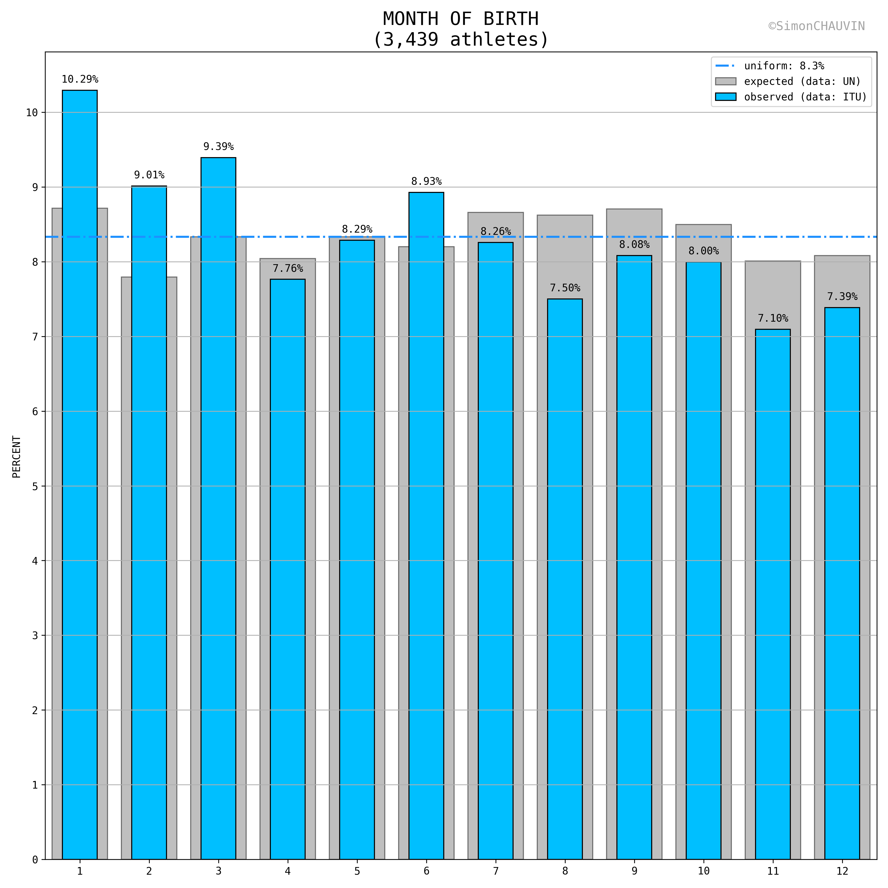     |
|:---------------------------------:|
| *Month-of-birth of ITU athletes.* |

The results are even more striking when considering the **year quarters**.

|       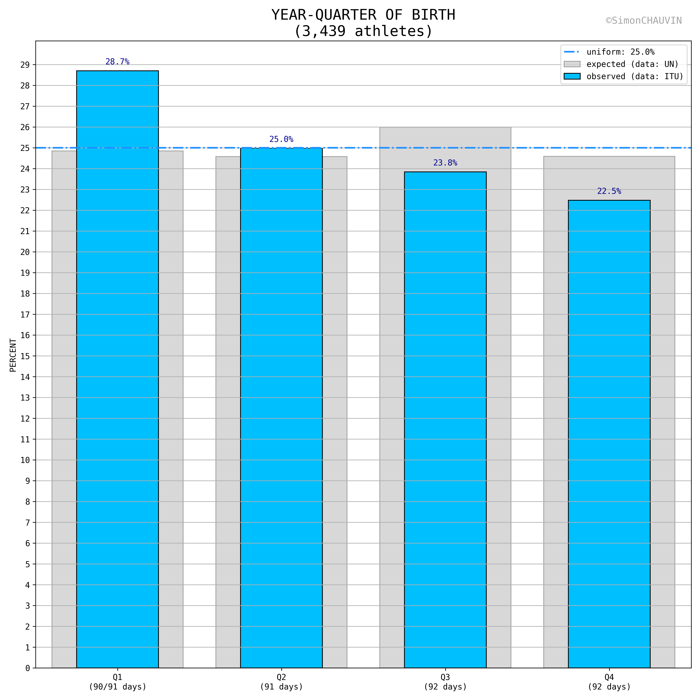        |
|:----------------------------------------:|
| *Year-quarter-of-birth of ITU athletes.* |

---

<details>
  <summary>Click to expand - 📊 <strong>Reference distribution from the United Nations.</strong></summary>

|                                                                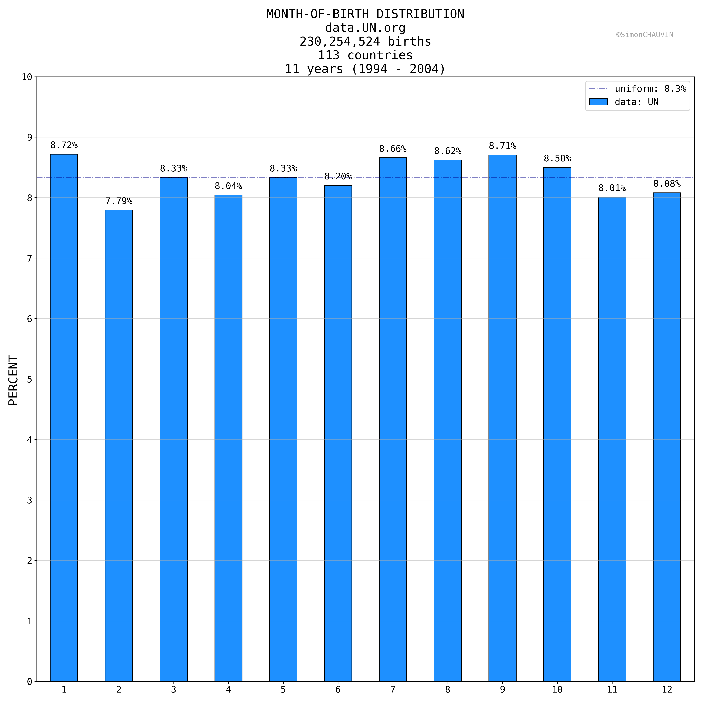                                                                 |
|:-----------------------------------------------------------------------------------------------------------------------------------------------------------:|
| *Month-of-birth distribution of the population aged 20-30 recorded by UN. Data source: [data.un.org](https://data.un.org/Data.aspx?d=POP&f=tableCode%3A55)* |

</details>

---

> _Can these discrepancies be due to differences between the two datasets (ITU and UN), such as the geographical origin of the births?_

<details>
  <summary>Click to expand - 🌍 <strong>Continent analysis.</strong></summary>

The **continent distributions** differ between the ITU and the UN datasets:

- **ITU dataset:** Europe is predominant (~59%). Asia  (~13%) and North America (~11%) follow.
- **UN dataset:** Asia (~34%), Europe (29%) and North America (24%) form a more uniform top-3.

|          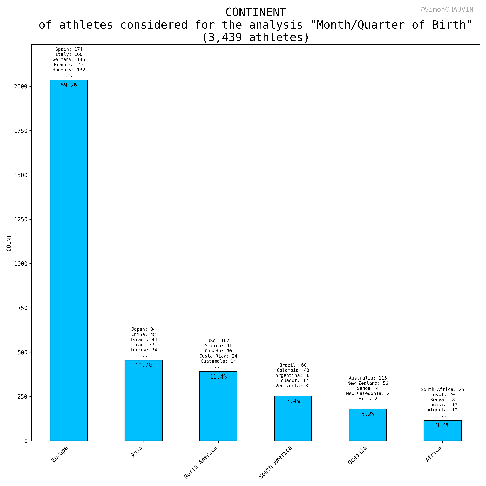           |
|:------------------------------------------------:|
| *Continents distribution of the **ITU** dataset* |

|                   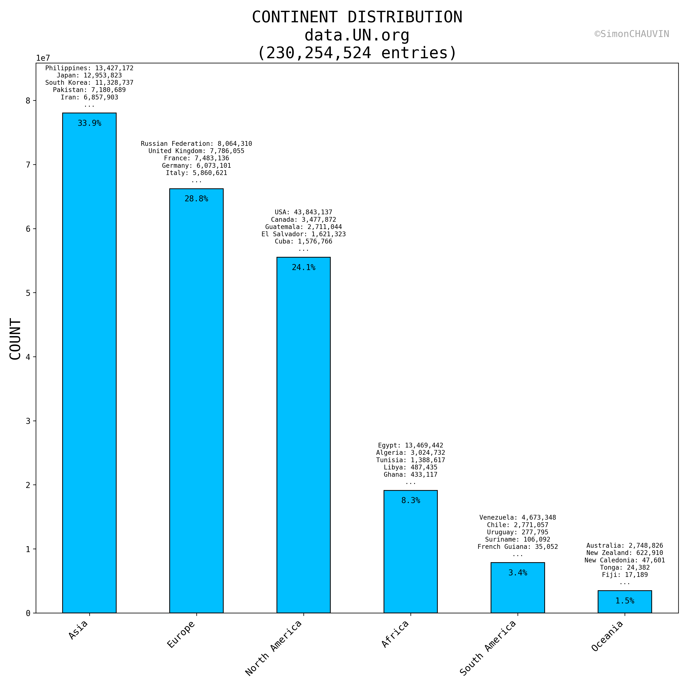                   |
|:--------------------------------------------------------------------:|
| *Continents distribution of the **UN** dataset (used as reference).* |

Note: The UN dataset has probably missed data from African and Asian countries such as China, India and Nigeria.

|                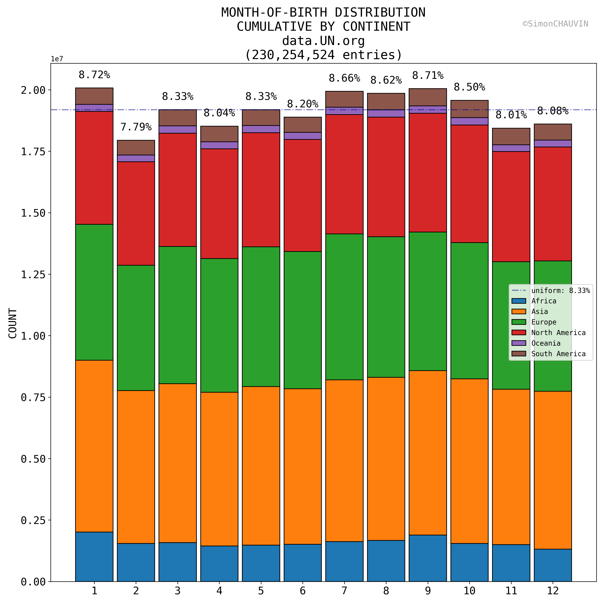                |
|:-------------------------------------------------------------------------:|
| *Another visualization of the **reference month-of-birth distribution**.* |

The month-of-birth and quarter-of-birth distributions for **each continent** can be visualized:

|   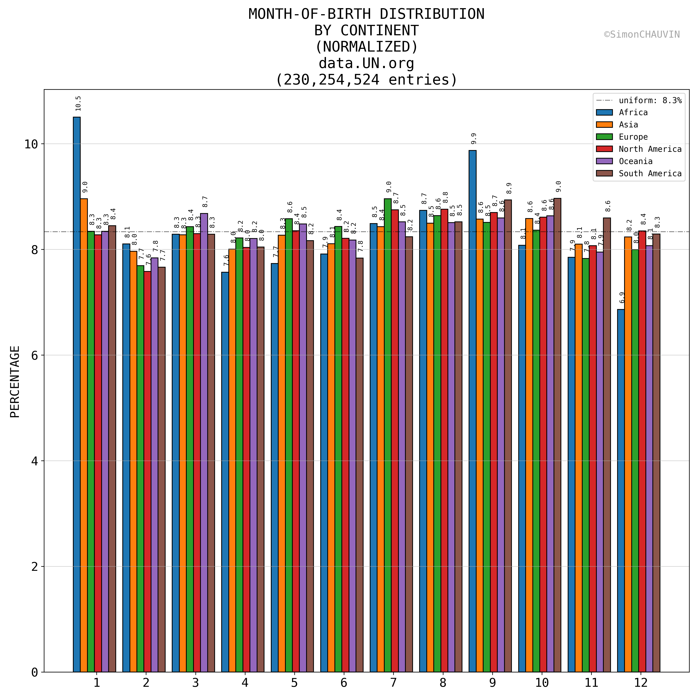    |
|:---------------------------------------------------------:|
| *Month-of-birth distribution, by continent (normalized).* |

|      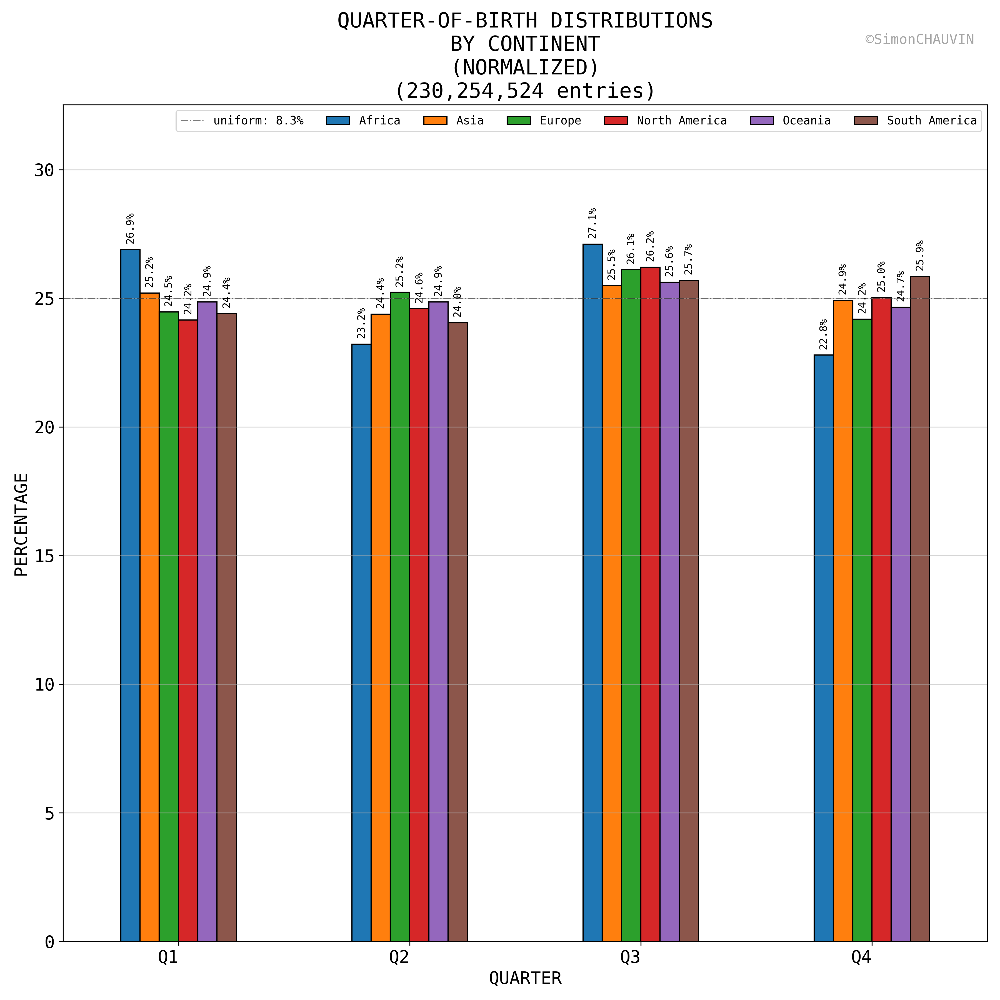      |
|:-----------------------------------------------------------:|
| *Quarter-of-birth distribution, by continent (normalized).* |

**Conclusion:**
- The continents mainly represented in the two datasets (ITU and UN) share **very similar month-of-birth and quarter-of-birth distributions**.
- Therefore, the difference in continent distributions **does not explain the discrepancy** in month-of-birth and quarter-of-birth distributions between the ITU and UN datasets.

</details>

---

<details>
  <summary>Click to expand - 🎂 <strong>Age distribution of ITU athletes used for this analysis.</strong></summary>

The UN and ITU datasets share the **same average age (25)**, but the **ITU age distribution is not uniform**, unlike the UN one.
- Importance sampling could be applied to the UN dataset to make the two distributions match, but I would be very surprised if that had an **impact on the overall conclusion**. 

|                    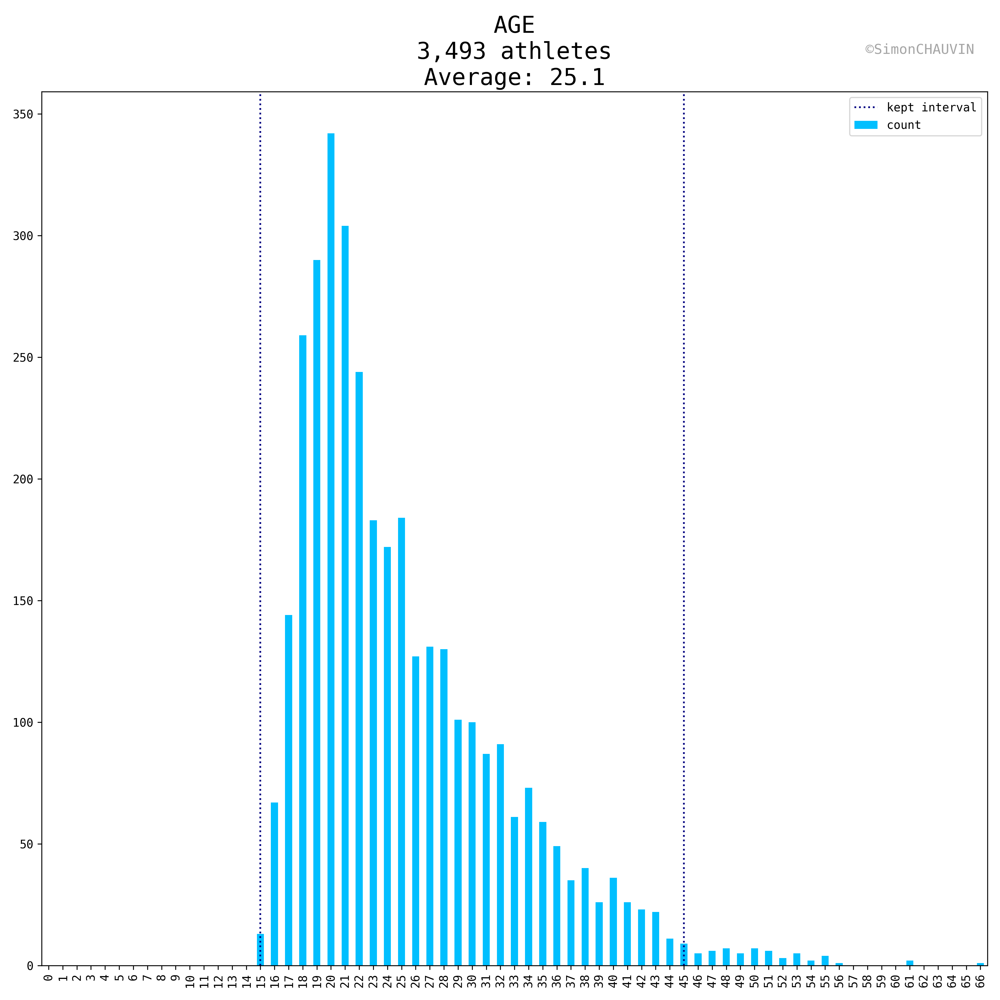                    | 
|:-------------------------------------------------------------:| 
| *Age of athletes considered for the month-of-birth analysis.* |

</details>

---

> _Is the difference between ITU and UN month- and quarter-of-birth distributions **statistically significant**?_

<details>
  <summary>Click to expand - 🧮 <strong>Statistical test.</strong></summary>

**3,439 birth entries** have been collected (**"observed"**) from the ITU data.
- A priori there is **no link** between the **quarter-of-birth** and the **fact of being a high-level triathlete**.
- Therefore, it can be **assumed** that the ITU observations **follow the UN distribution**.

From the UN distribution, the **expected** number of births for each quarter is computed:

|    |  OBSERVED (ITU)  |  EXPECTED (UN)  |
|:--:|:----------------:|:---------------:|
| Q1 |       987        |     854.443     |
| Q2 |       859        |     845.248     |
| Q3 |       820        |     893.717     |
| Q4 |       773        |     845.592     |

The number of births in the **two columns are very different**: more observations than expected for `Q1`, fewer for `Q3` and `Q4`.
- The situation is similar to the case of a **6-sided dice**, which is **suspected to be biased**. :game_die:
  - After rolling the die many times and counting each outcome, one can ask:
  - _Is just due to **randomness** or is it because the **dice is unfair**?_

Back to our problem:
- How to **quantify the deviation** between the two columns?

|    |  OBSERVED (ITU)  |  EXPECTED (UN)  |   DIFF   |  DIFF^2  |  DIFF^2 / EXPECTED  |
|:--:|:----------------:|:---------------:|:--------:|:--------:|:-------------------:|
| Q1 |       987        |     854.443     | 132.557  | 17571.3  |       20.5646       |
| Q2 |       859        |     845.248     | 13.7516  | 189.106  |      0.223728       |
| Q3 |       820        |     893.717     | -73.7166 | 5434.14  |       6.08039       |
| Q4 |       773        |     845.592     | -72.5916 | 5269.54  |       6.23178       |

One can compute the **differences between columns**, square them to ensure they are positive, normalize them and **sum the results**:
- `SUM OF [DIFF^2 / EXPECTED]` = `20.5646 + 0.2237 + 6.0804 + 6.2318` = **`33.10`**
- It `33.10` large? What does it mean? What can be concluded?

There is a mathematical formula that, given this computed number (`33.10`), answers the following question:
- _What is the **probability of observing such a discrepancy (`33.10`)** or an even larger one, **assuming** that the **ITU data should follow the UN** quarter-of-birth distribution?_
- In other words: _How likely is it that **the observed deviation** is due to **random chance**?_

For `33.10`, the formula gives `p = 0.0000003`, i.e. `0.00003%`.

**Conclusion:**
- The extremely low probability (`0.00003%`) indicates that the **observed differences** in quarters-of-birth among ITU triathletes are **highly unlikely to be due to random chance**.
- Therefore, the observed differences are **statistically significant**.
- This suggests a **systematic deviation from the expected UN distribution**.
- In other words, the quarters-of-birth of high-level triathletes **do not align with the general population** as represented by the UN distribution.

For more details about the derivation:
- An [article by Matteo Courthoud](https://matteocourthoud.github.io/post/chisquared/) to understand the [Chi-square test](https://en.wikipedia.org/wiki/Chi-squared_test).

</details>

---

:warning: These findings **do NOT indicate** that _"ITU athletes born in January **are more performant** than others born in later months"_!
- This birth-of-month analysis rather shows that **someone born earlier** in one year **is MORE LIKELY TO BECOME PRO TRIATHLETE** than one born later in the same year.

Here is one **possible explanation**:
- Kids born on **January, 1st and December 31st** of the same year compete in the **same age category**.
- For example, at the aged of 12, a 12-month difference represents **10% of their lifetime**.
- A 12-year kid born in January could, in theory, be ~10% **physically more developed (in terms of strength and stamina)** than one born in December.
- This **edge** could give an advantage to kids and teenagers born in the first months of a year during their early **races in youth categories**.
- They are **more likely** to **perform well, stand out, gain experience, and get selected for international competitions**, eventually **becoming professional**. :trophy:
  - Similar to a snowball effect. :cyclone:

---

---

# :weight_lifting: BODY MASS INDEX

> "The [BMI](https://en.wikipedia.org/wiki/Body_mass_index) is defined as the **body mass** divided by the **square of the body height**, and is expressed in units of kg/m^2"

To maximize the amount of data, **all athletes registered with the ITU** are considered (not just those participating in world-cups and world-series).
- In total, **504 athletes** aged between 15 and 53 (average is 27) are included.

| 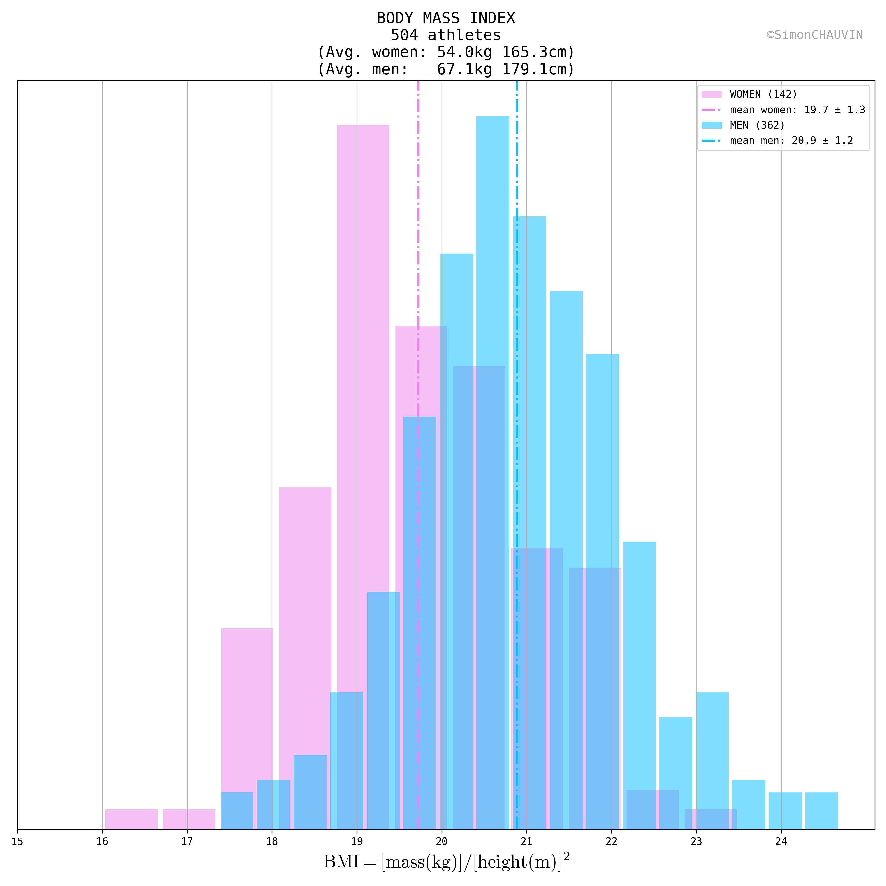 | 
|:-----------------------:| 
|   *Body mass index.*    |

| 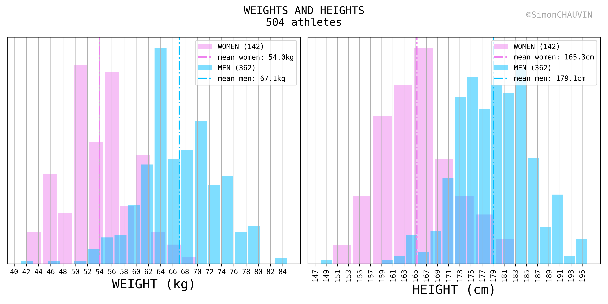 | 
|:-------------------------------------------:| 
|           *Weights and Heights.*            |


First, is the BMI a **relevant metric** here? No!
- It is useful for public health, providing a quick and simple measure to identify **trends in obesity and underweight conditions**.
- But **it does not measure fitness levels, physical endurance, strength, flexibility, or other aspects of physical health**.
- Many athletes may have a high BMI due to increased **muscle mass**, yet they are fit and healthy.

Second, there is no enough data.
- **Only 14%** of ITU registered athletes have valid weight and height information (504 out of 3560).
- Most athletes did not input their dimensions.
- Sometimes for privacy reasons, e.g. the entry for Kristian Blummenfelt's ( :norway: ) weight: _"None of your business"_.

Third, some data may be outdated.
- The body weight that can **vary during a career** (many athletes enter the database as juniors) or even during a season.

Alternative metrics such as _Body Fat Percentage_ or _Muscle Mass Percentage_ would be more appropriate for **fitness assessment**.

If **not much can be concluded**, comparing oneself to the distributions can still be interesting.

<details>
  <summary>Click to expand - 📏 <strong>Non-standardized data format!</strong></summary>

Here are examples of `height` data. :straight_ruler:

```
 '6 Foot',
 "194, 6'4",
 '1.76 mts',
 '62 kg ',
 '1.80 meters',
 '174m',
 '5\'2"',
 '165 cms',
 '1,81 CM',
 '6ft. 2in.',
 '6ft 2in',
 '5’7”',
 '6 ft 0 in',
 '170cm/5.58ft',
 '57kg',
 '5.5ft',
 '1,77mts',
 'MT. 175',
 '164,4cm',
 '1.66 MTS',
 '5\'8"',
 '183 cm',
 "6'4",
 '1.9m',
 '6 Ft',
 "1'72",
 '186cm',
 '182',
 '180 ',
 '182CM'
```

And some `weight` data. :weight_lifting:
```
 'None of your business ',
 '160',
 '70 kg “in season “ ;-)',
 '1:68 m ',
 '140 lb',
 '51kgs ',
 '138 LBs',
 '1,78',
 '75 KG',
 '135ibs',
 '54kg/119lb',
 '42 kilo',
 '135IIbs',
 '187 lbs',
 'KG. 62',
 '49,4 kg',
 '67KG',
 '62 Kg',
 '175',
 '145lb',
 '52kg',
 '67',
 '140 Ibs',
 '65',
 '75 ',
 '66KG'
```

Interesting to see the **different units and formats**.

Some **processing and filtering** are required! :broom:

</details>

---

---

# :scroll: CONCLUSION

## :bulb: IDEAS

Here are **some ideas** for **data to explore**:

#### :mag: 1) MORE DETAILED RACES ANALYSES

As mentioned by Alex Yee in [this video](https://youtu.be/zoYeVlM28J4?t=689):

> "You are doing a **full gas effort** at the start of a race which is **2 hours long**. If you told somebody to do that on a marathon, they would laugh in your face."

ITU data provides **a single time** for **each leg**: swim, t1, bike, t2, run. There is no detail about the pace evolution **during each segment**. For instance:
- Fast swim start to reach the first buoy.
- Fast bike start to break away or catch a pack.
- Fast run start - _I have never really understood the benefit compared to a steady effort._
- Fast run finish.

Some events, such as [Paris Olympics](https://olympics.com/en/paris-2024/results/triathlon/men-s-individual/fnl-000100--), offer **detailed results with lap times**.
- It is for instance very instructive to **compare the runs** of Alex Yee ( :gb: ), Hayden Wilde ( :new_zealand: ) and Léo Bergère ( :fr: ).
- The first two completed the **first 1050m in `2:42`**.
- Alex Yee then "slowed down" to ~`3:00` for the following three laps, while Léo Bergère was **a bit more regular**: `2:49`, `2:56`, `3:01`, `2:54`.
- Such data should be very interesting to analyse.

In addition to **paces**, it would be interesting to access **data** such as:
- Swim **stroke rate**.
- Bike **power** and cadence.
- Run **cadence**.
- Run **maximum speed** during the sprint.
- **Heart rate**.
- ...
- For comparison, heart rate information from some athletes is shown in UCI mountain-bike world-cups videos.

**Activity trackers** would be needed for these recordings, but athletes **rarely wear them** while racing, making **swim** and **run data recording** difficult.
- _This is also something I find puzzling: such data should be **invaluable for elite athletes**, shouldn't it?_ 
  - I first thought it was **forbidden** during the swim. The [**ITU rules**](https://www.triathlon.org/about/downloads/category/competition_rules) are **not very clear** to me:
    - "Athletes may not use **communication devices** of any type, including but not limited to cell phones, **smart watches** ...".
    - "Propulsion devices that create an advantage for the athlete, or a risk to others, are forbidden". _Could a sport-watch increase the propulsion surface or be harmful to others in case of contact?_
    - On the other hand, the **swim section** states: "**Electronic devices may be used** in the **competition** unless they are distracting the athlete from paying full attention to their surroundings".
- A recent exception was [Cassandre Beaugrand ( :fr: ) in Gagliari ( :it: )](https://youtu.be/vFV-kB8727I?t=189). Also at the [Olympics in Paris](https://www.francetvinfo.fr/les-jeux-olympiques/triathlon/triathlon-aux-jo-de-paris-2024-cassandre-beaugrand-de-princesse-a-reine-du-triathlon_6698148.html). _Maybe to pace her 10k?_
- The **GPS features** of activity trackers could also provide **more precise estimations of the course distances**.
  - Especially for the **run**, and even for the **swim, to compare the lines**.
- Some athletes seem to use **heart rate monitor (HRM) belts**, such as [Kristian Blummenfeld ( :norway: ) at Tokyo 2021](https://triathlon.org/news/article/kristian_blummenfelt_crowned_tokyo_2020_olympic_champion).
  - But as far as I know, no **stroke rate**, **cadence** or **GPS** data can be recorded with these devices.

**Strava** could be used to retrieve activities:
- Many athletes **publish** their activities there, either their races (often limited to the bike section) or training sessions.
- However, as mentioned, almost **no swim or run** information is recorded during **races**.

#### :shopping: 2) EQUIPMENT CHOICE
- For instance, which **wetsuits and running shoes** athletes **prefer**.
- Not all athletes are **sponsored** by swimming or running brands.
- Therefore, **some are free to try, compare, and select** the equipment they believe will **make them faster**.

#### :moneybag: 3) MONEY

It would be interesting to investigate the **financial aspects** of the competitions, such as:
- The **prize money** for the different ITU race categories.
- The event **registration costs**.
- Eventually, to estimate **from which rank an athlete can make a descent living**. (Of course sponsoring and federation support also play a role).

#### :spaghetti: 4) MISCELLANEOUS

- Analyse the **correlation** between **transition ranking** and **finish ranking**. Especially for T2.
- ...

---

## :computer: CODE

Plots can be reproduced:

- Create a key for the ITU API: https://apps.api.triathlon.org/ and add it to a `api_key.txt` file placed in `itu_stats/`.
- Install the required python packages.
- Run the different scripts of this repository.

---

## :takeout_box: TAKEAWAYS

:warning: Most **summary numbers** given in this section are **AVERAGES**.
- For instance **race-averages** are computed from the 5th to 9th best times of **each leg**, and sometimes **averaged** over multiples years.

Here are some **key takeaways**:
- :stopwatch: The three sports account for **16.4%** (:swimmer:), **53.1%** (:bicyclist:), **28.9%** (:runner:) of the overall time. Transitions for 1.1% and 0.5%.
- :athletic_shoe: While **swim and bike paces are similar** between sprint and olympic formats, the **10k run** requires **7 s/km** more than the 5k.
- :swimmer: Women swim at **1:18 / 100m**, men at **1:12 / 100m**.
- :bicyclist: Women ride **4 km/h slower**, at **37.4 km/h**, compared to men at **41.4 km/h**.
- :runner: Women run the 10k at **3:34 min/km** (3:27 for 5k), men at **3:08 min/km** (3:01 for 5k). 
- :couple: **Women swim 8.8% slower** than men with the same equipment. They also **ride 10.6%** and **run 14.2%** slower.
- :penguin: There is **no evidence that wetsuits reduce swim gaps** between top and less competitive swimmers.
- :one_piece_swimsuit: Swim times are **~5.5% faster with wetsuit**.
- :fr: The **swim** of 2024 Paris Olympics was **unusually long** (more than **2:30 longer**), probably because of the current in La Seine. In particular, the 5-9th women swam **more than 1:30 / 100m**.
- :zap: Winning by a **run comeback**, i.e. after not ending the bike in the front group, is entertaining but **rare** (28% for men and 7% for women) in the olympic format and is getting even rarer.
- :bicyclist: The **size of the front group** after bike averages around **15**, decreases to 4 or fewer (**small breakaway**) in about **1/4 of women's** and **1/3 of men's** olympic-races.
- :athletic_shoe: Over **2/3 of races** are won by the **best runner**.
- :camera_flash: Winning via **sprint finish** is more common in men's races, occurring **50% more frequently**.
- :woman_cartwheeling: Women's races occasionally feature **wins by very large margins**.
- :straight_ruler: The gaps between the winner and second place are, on average, **twice as large** in olympic formats compared to sprint formats, and **twice as large** for women compared to men.
- :rocket: **Bike** and **run** times in WTCS olympic races have reached **all-time lows**.
- :calendar: On average, athletes raced **10 times** (in world cups or world series) in 2019 and 2023, compared to **6 times in 2009**.
- :calendar: Their ITU season has extended from **130 days** in 2009 to **200 days** in 2023.
- :ticket: The limit of **3 athletes per nation** for the Olympics creates challenges for the highly represented nations such as :us:, :gb:, :australia:, :de: and :fr:.
- :birthday: Athletes finishing 5th-9th are, on average, **26.5 to 27.5 years old**.
- :checkered_flag: Women and men typically race their last ITU world-cup or WTCS at an average age of **31 years**, thought there are significant variations.
- :bar_chart: Someone **born earlier in the year** are **more likely** to become professional triathletes compared to those born later in the same year.

---

**Thank you for reading until the end!**
- If you have any questions, suggestions, corrections, or comments, please feel free to contact me at `simon.chauvin.contact[at]gmail.com`.
- Cheers,
- Simon :smiley:
